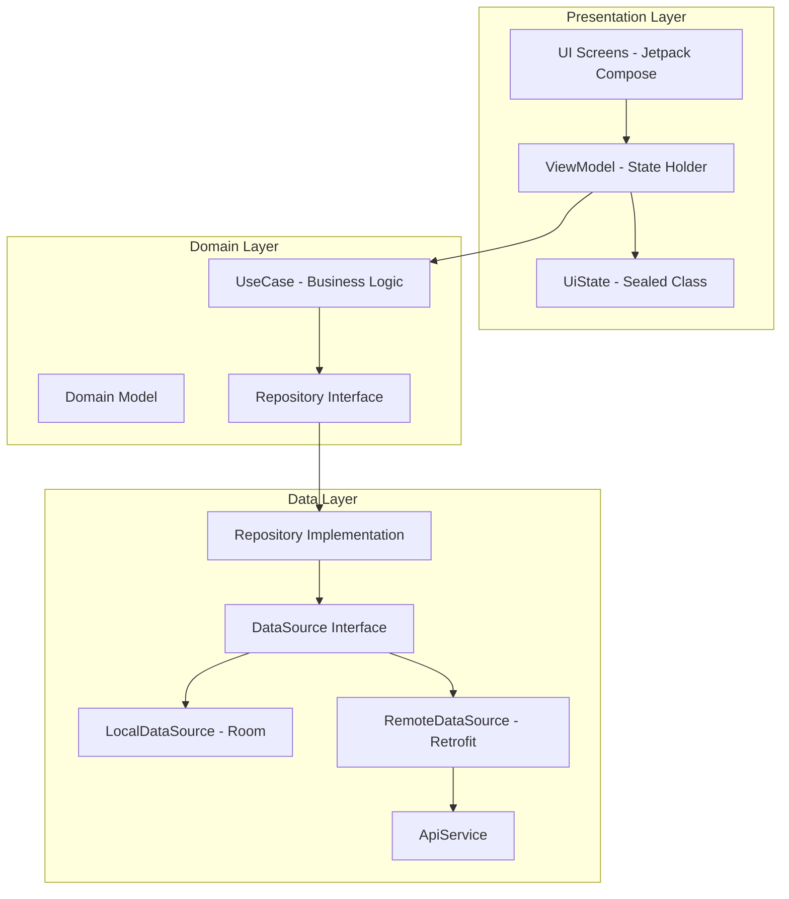
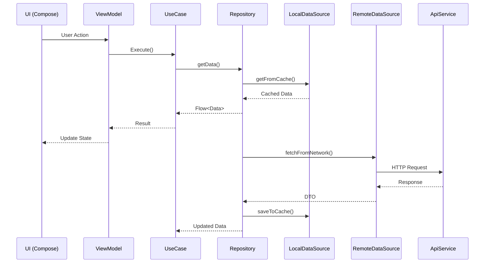

# Android Kotlin Mobile App - Customer Module Prompt

## 📋 Project Overview

Develop a **Customer-Facing Android Mobile Application** for the Lofi Loan Management System using **Kotlin** and **Jetpack Compose**. This app focuses exclusively on **Customer (Borrower)** functionality with clean architecture, offline-first capability, comprehensive testing, and hardware integration (Biometric, Location, Camera, File Upload).

---

## 🎯 Scope - Customer Features Only

### Authentication & Profile

- **Login with Firebase Authentication** - Multiple options:
  - Email/Password (traditional login)
- Register new account via Firebase
- Forgot Password via Firebase
- Change Password
- View Profile Detail
- Edit/Update Profile

### Hardware Integration

- **Biometric Authentication** - Fingerprint/Face ID verification before loan submission
- **Location Access** - GPS coordinates capture for loan application
- **Camera Access** - Take photos for document upload (KTP, Selfie, etc.)
- **File Upload** - Select and upload documents from gallery/filesystem

### Loan Management

- View My Plafond (Credit Limit)
- Apply for Loan (with Biometric Verification, Location Capture, Document Upload)
- View My Loans (Active & History)
- Loan Detail View
- Loan Simulation Calculator

### Hardware Integration

- **Biometric Authentication** - Fingerprint/Face ID verification before loan submission
- **Location Access** - GPS coordinates capture for loan application
- **Camera Access** - Take photos for document upload (KTP, Selfie, etc.)
- **File Upload** - Select and upload documents from gallery/filesystem

---

## 🔐 Hardware Integration Implementation

### 1. Biometric Authentication for Loan Submission

#### Overview

Biometric authentication is required before submitting a loan application to ensure the user's identity and prevent fraudulent submissions.

#### Implementation

```kotlin
// core/biometric/BiometricManager.kt
interface BiometricAuthenticator {
    suspend fun authenticate(): BiometricResult
    fun isBiometricAvailable(): Boolean
    fun isBiometricEnrolled(): Boolean
}

// core/biometric/BiometricResult.kt
sealed class BiometricResult {
    object Success : BiometricResult()
    data class Error(val error: BiometricError) : BiometricResult()
    object Cancelled : BiometricResult()
}

enum class BiometricError {
    NO_HARDWARE,
    HARDWARE_UNAVAILABLE,
    NOT_ENROLLED,
    LOCKOUT,
    UNKNOWN
}

// feature/loan/presentation/applyloan/ApplyLoanViewModel.kt
class ApplyLoanViewModel @Inject constructor(
    private val applyLoanUseCase: ApplyLoanUseCase,
    private val biometricAuthenticator: BiometricAuthenticator
) : ViewModel() {
    
    fun submitLoan(request: LoanApplicationRequest) {
        viewModelScope.launch {
            // Step 1: Check if biometric is available
            if (!biometricAuthenticator.isBiometricAvailable()) {
                _uiState.value = ApplyLoanUiState.Error(
                    "Biometric authentication is required for loan submission"
                )
                return@launch
            }
            
            // Step 2: Authenticate with biometric
            _uiState.value = ApplyLoanUiState.BiometricAuthenticating
            
            when (val result = biometricAuthenticator.authenticate()) {
                is BiometricResult.Success -> {
                    // Step 3: Proceed with loan submission
                    _uiState.value = ApplyLoanUiState.Submitting
                    applyLoanUseCase(request).collect { result ->
                        _uiState.value = when (result) {
                            is BaseResult.Success -> ApplyLoanUiState.Success(result.data)
                            is BaseResult.Error -> ApplyLoanUiState.Error(result.error)
                            else -> ApplyLoanUiState.Loading
                        }
                    }
                }
                is BiometricResult.Error -> {
                    _uiState.value = ApplyLoanUiState.Error(
                        "Biometric authentication failed: ${result.error}"
                    )
                }
                is BiometricResult.Cancelled -> {
                    _uiState.value = ApplyLoanUiState.Idle
                }
            }
        }
    }
}
```

#### UI Implementation

```kotlin
// feature/loan/presentation/applyloan/ApplyLoanScreen.kt
@Composable
fun ApplyLoanScreen(
    viewModel: ApplyLoanViewModel = hiltViewModel(),
    onNavigateBack: () -> Unit
) {
    val uiState by viewModel.uiState.collectAsState()
    val context = LocalContext.current
    
    // Biometric prompt setup
    val biometricPrompt = rememberBiometricPrompt(
        onSuccess = { viewModel.onBiometricSuccess() },
        onError = { error -> viewModel.onBiometricError(error) },
        onCancel = { viewModel.onBiometricCancelled() }
    )
    
    when (uiState) {
        is ApplyLoanUiState.BiometricAuthenticating -> {
            LaunchedEffect(Unit) {
                biometricPrompt.authenticate(
                    title = "Verify Identity",
                    subtitle = "Use biometric to confirm loan submission",
                    negativeButtonText = "Cancel"
                )
            }
        }
        // ... other states
    }
}
```

#### Dependencies

```toml
# gradle/libs.versions.toml
[versions]
biometric = "1.1.0"

[libraries]
biometric = { group = "androidx.biometric", name = "biometric", version.ref = "biometric" }
```

---

### 2. Location Access for Loan Application

#### Overview

GPS coordinates are captured during loan application for verification and fraud prevention purposes.

#### Implementation

```kotlin
// core/location/LocationManager.kt
interface LocationManager {
    suspend fun getCurrentLocation(): LocationResult
    suspend fun getLastKnownLocation(): LocationResult?
    fun hasLocationPermission(): Boolean
    fun requestLocationPermission(): Flow<PermissionResult>
}

sealed class LocationResult {
    data class Success(
        val latitude: Double,
        val longitude: Double,
        val accuracy: Float,
        val timestamp: Long
    ) : LocationResult()
    
    data class Error(val error: LocationError) : LocationResult()
}

enum class LocationError {
    PERMISSION_DENIED,
    LOCATION_DISABLED,
    TIMEOUT,
    UNKNOWN
}

// feature/loan/presentation/applyloan/ApplyLoanViewModel.kt
class ApplyLoanViewModel @Inject constructor(
    private val applyLoanUseCase: ApplyLoanUseCase,
    private val locationManager: LocationManager
) : ViewModel() {
    
    private val _locationState = MutableStateFlow<LocationResult?>(null)
    val locationState: StateFlow<LocationResult?> = _locationState.asStateFlow()
    
    fun captureLocation() {
        viewModelScope.launch {
            _locationState.value = LocationResult.Loading
            _locationState.value = locationManager.getCurrentLocation()
        }
    }
    
    fun submitLoan(loanData: LoanApplicationData) {
        viewModelScope.launch {
            val location = _locationState.value
            
            val request = when (location) {
                is LocationResult.Success -> {
                    loanData.copy(
                        latitude = location.latitude,
                        longitude = location.longitude
                    )
                }
                else -> loanData // Submit without location if unavailable
            }
            
            applyLoanUseCase(request).collect { result ->
                // Handle result
            }
        }
    }
}
```

#### UI Implementation

```kotlin
// feature/loan/presentation/applyloan/components/LocationCapture.kt
@Composable
fun LocationCapture(
    locationResult: LocationResult?,
    onRequestLocation: () -> Unit,
    modifier: Modifier = Modifier
) {
    Card(modifier = modifier.fillMaxWidth()) {
        Column(
            modifier = Modifier.padding(16.dp),
            verticalArrangement = Arrangement.spacedBy(8.dp)
        ) {
            Text(
                text = "Location Verification",
                style = MaterialTheme.typography.titleMedium
            )
            
            when (locationResult) {
                is LocationResult.Success -> {
                    LocationSuccessView(
                        latitude = locationResult.latitude,
                        longitude = locationResult.longitude
                    )
                }
                is LocationResult.Error -> {
                    LocationErrorView(
                        error = locationResult.error,
                        onRetry = onRequestLocation
                    )
                }
                LocationResult.Loading -> {
                    CircularProgressIndicator()
                }
                null -> {
                    Button(onClick = onRequestLocation) {
                        Text("Capture Location")
                    }
                }
            }
        }
    }
}
```

#### Permissions

```xml
<!-- AndroidManifest.xml -->
<uses-permission android:name="android.permission.ACCESS_FINE_LOCATION" />
<uses-permission android:name="android.permission.ACCESS_COARSE_LOCATION" />
```

---

### 3. Camera and File Upload Functionality

#### Overview

Document upload functionality supports both camera capture and file selection from gallery/filesystem for KTP, selfie, and other required documents.

#### Implementation

```kotlin
// core/media/CameraManager.kt
interface CameraManager {
    suspend fun captureImage(): CameraResult
    suspend fun selectFromGallery(): CameraResult
    suspend fun compressImage(imagePath: String, maxSizeKB: Int): String
}

sealed class CameraResult {
    data class Success(val imagePath: String, val mimeType: String) : CameraResult()
    data class Error(val message: String) : CameraResult()
    object Cancelled : CameraResult()
}

// core/media/UploadManager.kt
interface UploadManager {
    suspend fun uploadDocument(
        filePath: String,
        documentType: DocumentType,
        loanId: String? = null
    ): UploadResult
    
    suspend fun uploadToPresignedUrl(
        filePath: String,
        presignedUrl: String
    ): Boolean
}

sealed class UploadResult {
    data class Success(val documentId: String, val url: String) : UploadResult()
    data class Error(val message: String) : UploadResult()
    data class Progress(val percentage: Int) : UploadResult()
}

// feature/loan/presentation/applyloan/components/DocumentUpload.kt
@Composable
fun DocumentUploadSection(
    viewModel: ApplyLoanViewModel,
    modifier: Modifier = Modifier
) {
    val documents by viewModel.documents.collectAsState()
    val context = LocalContext.current
    
    // Image picker launcher
    val galleryLauncher = rememberLauncherForActivityResult(
        contract = ActivityResultContracts.GetContent()
    ) { uri ->
        uri?.let { viewModel.onDocumentSelected(it, DocumentType.KTP) }
    }
    
    // Camera launcher
    val cameraLauncher = rememberLauncherForActivityResult(
        contract = ActivityResultContracts.TakePicture()
    ) { success ->
        if (success) {
            viewModel.onCameraCaptureSuccess()
        }
    }
    
    Column(modifier = modifier) {
        Text(
            text = "Required Documents",
            style = MaterialTheme.typography.titleMedium
        )
        
        // KTP Upload
        DocumentUploadCard(
            title = "KTP",
            document = documents.ktp,
            onCameraClick = { viewModel.captureKtpWithCamera(cameraLauncher) },
            onGalleryClick = { galleryLauncher.launch("image/*") }
        )
        
        // Selfie Upload
        DocumentUploadCard(
            title = "Selfie",
            document = documents.selfie,
            onCameraClick = { viewModel.captureSelfieWithCamera(cameraLauncher) },
            onGalleryClick = { galleryLauncher.launch("image/*") }
        )
    }
}

@Composable
fun DocumentUploadCard(
    title: String,
    document: DocumentUploadState?,
    onCameraClick: () -> Unit,
    onGalleryClick: () -> Unit
) {
    Card(
        modifier = Modifier
            .fillMaxWidth()
            .padding(vertical = 8.dp)
    ) {
        Column(modifier = Modifier.padding(16.dp)) {
            Text(text = title, style = MaterialTheme.typography.titleSmall)
            
            when (document) {
                is DocumentUploadState.Uploaded -> {
                    AsyncImage(
                        model = document.url,
                        contentDescription = title,
                        modifier = Modifier
                            .fillMaxWidth()
                            .height(150.dp)
                    )
                }
                is DocumentUploadState.Uploading -> {
                    LinearProgressIndicator(
                        progress = { document.progress / 100f },
                        modifier = Modifier.fillMaxWidth()
                    )
                }
                null -> {
                    Row(
                        horizontalArrangement = Arrangement.spacedBy(8.dp)
                    ) {
                        OutlinedButton(onClick = onCameraClick) {
                            Icon(Icons.Default.CameraAlt, contentDescription = null)
                            Text("Camera")
                        }
                        OutlinedButton(onClick = onGalleryClick) {
                            Icon(Icons.Default.PhotoLibrary, contentDescription = null)
                            Text("Gallery")
                        }
                    }
                }
            }
        }
    }
}
```

#### ViewModel Integration

```kotlin
// feature/loan/presentation/applyloan/ApplyLoanViewModel.kt
class ApplyLoanViewModel @Inject constructor(
    private val uploadManager: UploadManager,
    private val cameraManager: CameraManager
) : ViewModel() {
    
    private val _documents = MutableStateFlow(DocumentsState())
    val documents: StateFlow<DocumentsState> = _documents.asStateFlow()
    
    fun onDocumentSelected(uri: Uri, type: DocumentType) {
        viewModelScope.launch {
            _documents.update { current ->
                current.copyWithDocument(type, DocumentUploadState.Uploading(0))
            }
            
            // Compress image before upload
            val compressedPath = cameraManager.compressImage(
                imagePath = uri.toString(),
                maxSizeKB = 1024 // 1MB max
            )
            
            // Upload document
            uploadManager.uploadDocument(
                filePath = compressedPath,
                documentType = type
            ).collect { result ->
                when (result) {
                    is UploadResult.Progress -> {
                        _documents.update { current ->
                            current.copyWithDocument(
                                type,
                                DocumentUploadState.Uploading(result.percentage)
                            )
                        }
                    }
                    is UploadResult.Success -> {
                        _documents.update { current ->
                            current.copyWithDocument(
                                type,
                                DocumentUploadState.Uploaded(result.documentId, result.url)
                            )
                        }
                    }
                    is UploadResult.Error -> {
                        _documents.update { current ->
                            current.copyWithDocument(
                                type,
                                DocumentUploadState.Error(result.message)
                            )
                        }
                    }
                }
            }
        }
    }
}

// Document Upload State
data class DocumentsState(
    val ktp: DocumentUploadState? = null,
    val selfie: DocumentUploadState? = null,
    val npwp: DocumentUploadState? = null,
    val slipGaji: DocumentUploadState? = null
) {
    fun copyWithDocument(
        type: DocumentType,
        state: DocumentUploadState
    ): DocumentsState = when (type) {
        DocumentType.KTP -> copy(ktp = state)
        DocumentType.SELFIE -> copy(selfie = state)
        DocumentType.NPWP -> copy(npwp = state)
        DocumentType.SLIP_GAJI -> copy(slipGaji = state)
        else -> this
    }
}

sealed class DocumentUploadState {
    data class Uploading(val progress: Int) : DocumentUploadState()
    data class Uploaded(val documentId: String, val url: String) : DocumentUploadState()
    data class Error(val message: String) : DocumentUploadState()
}
```

#### Permissions

```xml
<!-- AndroidManifest.xml -->
<uses-permission android:name="android.permission.CAMERA" />
<uses-permission android:name="android.permission.READ_EXTERNAL_STORAGE" 
    android:maxSdkVersion="32" />
<uses-permission android:name="android.permission.READ_MEDIA_IMAGES" />

<uses-feature android:name="android.hardware.camera" android:required="false" />
```

---

### Notifications

- Push Notifications via Firebase Cloud Messaging (FCM)
- Notification List
- Notification Detail
- **Smart Deep Linking**:
  - Loan-related notifications → Navigate to Loan screen
  - Auth-related notifications → Navigate to Auth screen

---

## 🏗️ Architecture

### MVVM + Clean Architecture Layers



### Data Flow



---

## 📁 Folder Structure

```
app/
├── build.gradle.kts
├── src/
│   ├── main/
│   │   ├── java/com/lofi/mobile/
│   │   │   ├── LofiApplication.kt
│   │   │   ├── MainActivity.kt
│   │   │   │
│   │   │   ├── core/                          # Core Module
│   │   │   │   ├── common/                    # Shared Components
│   │   │   │   │   ├── result/                # BaseResult Wrapper
│   │   │   │   │   │   ├── BaseResult.kt
│   │   │   │   │   │   ├── ResultExtensions.kt
│   │   │   │   │   │   └── ErrorType.kt
│   │   │   │   │   ├── exception/             # Global Exception
│   │   │   │   │   │   ├── GlobalExceptionHandler.kt
│   │   │   │   │   │   ├── DeveloperException.kt
│   │   │   │   │   │   └── ErrorTracker.kt
│   │   │   │   │   ├── constants/             # Constants (No Hardcoded Strings)
│   │   │   │   │   │   ├── AppConstants.kt
│   │   │   │   │   │   ├── ApiConstants.kt
│   │   │   │   │   │   └── DataStoreKeys.kt
│   │   │   │   │   └── util/                  # Utilities
│   │   │   │   │       ├── DateUtils.kt
│   │   │   │   │       ├── CurrencyUtils.kt
│   │   │   │   │       └── ValidationUtils.kt
│   │   │   │   │
│   │   │   │   ├── datastore/                 # DataStore (Replace AppPreference)
│   │   │   │   │   ├── PreferencesDataStore.kt
│   │   │   │   │   ├── UserPreferences.kt
│   │   │   │   │   └── SettingsPreferences.kt
│   │   │   │   │
│   │   │   │   ├── network/                   # Network Module
│   │   │   │   │   ├── di/NetworkModule.kt
│   │   │   │   │   ├── interceptor/
│   │   │   │   │   │   ├── AuthInterceptor.kt
│   │   │   │   │   │   ├── LoggingInterceptor.kt
│   │   │   │   │   │   └── ErrorInterceptor.kt
│   │   │   │   │   └── response/
│   │   │   │   │       ├── BaseResponse.kt    # Wrap Success & Failure
│   │   │   │   │       ├── ApiResponse.kt
│   │   │   │   │       └── ErrorResponse.kt
│   │   │   │   │
│   │   │   │   ├── database/                  # Room Database
│   │   │   │   │   ├── AppDatabase.kt
│   │   │   │   │   ├── di/DatabaseModule.kt
│   │   │   │   │   ├── dao/
│   │   │   │   │   │   ├── UserDao.kt
│   │   │   │   │   │   ├── LoanDao.kt
│   │   │   │   │   │   ├── NotificationDao.kt
│   │   │   │   │   │   └── PlafondDao.kt
│   │   │   │   │   └── entity/
│   │   │   │   │       ├── UserEntity.kt
│   │   │   │   │       ├── LoanEntity.kt
│   │   │   │   │       ├── NotificationEntity.kt
│   │   │   │   │       └── PlafondEntity.kt
│   │   │   │   │
│   │   │   │   ├── biometric/                 # Biometric Authentication
│   │   │   │   │   ├── BiometricManager.kt
│   │   │   │   │   ├── BiometricPromptManager.kt
│   │   │   │   │   ├── BiometricResult.kt
│   │   │   │   │   └── di/BiometricModule.kt
│   │   │   │   │
│   │   │   │   ├── location/                  # Location Services
│   │   │   │   │   ├── LocationManager.kt
│   │   │   │   │   ├── LocationResult.kt
│   │   │   │   │   └── di/LocationModule.kt
│   │   │   │   │
│   │   │   │   ├── media/                     # Camera & File Upload
│   │   │   │   │   ├── CameraManager.kt
│   │   │   │   │   ├── FilePickerManager.kt
│   │   │   │   │   ├── ImageCompressor.kt
│   │   │   │   │   ├── UploadManager.kt
│   │   │   │   │   └── di/MediaModule.kt
│   │   │   │   │
│   │   │   │   ├── navigation/                # Navigation
│   │   │   │   │   ├── AppNavigation.kt
│   │   │   │   │   ├── NavigationRoutes.kt
│   │   │   │   │   ├── DeepLinkHandler.kt
│   │   │   │   │   └── NotificationNavigator.kt
│   │   │   │   │
│   │   │   │   ├── firebase/                  # Firebase Integration
│   │   │   │   │   ├── FirebaseModule.kt
│   │   │   │   │   ├── FcmService.kt
│   │   │   │   │   ├── NotificationManager.kt
│   │   │   │   │   └── TokenManager.kt
│   │   │   │   │
│   │   │   │   ├── di/                        # Hilt DI Modules
│   │   │   │   │   ├── AppModule.kt
│   │   │   │   │   ├── RepositoryModule.kt
│   │   │   │   │   ├── UseCaseModule.kt
│   │   │   │   │   └── DataSourceModule.kt
│   │   │   │   │
│   │   │   │   └── ui/                        # Core UI Components
│   │   │   │       ├── theme/
│   │   │   │       │   ├── Color.kt
│   │   │   │       │   ├── Theme.kt
│   │   │   │       │   ├── Type.kt
│   │   │   │       │   └── Shape.kt
│   │   │   │       ├── components/            # Reusable Components
│   │   │   │       │   ├── buttons/
│   │   │   │       │   │   ├── PrimaryButton.kt
│   │   │   │       │   │   ├── SecondaryButton.kt
│   │   │   │       │   │   └── GoogleSignInButton.kt
│   │   │   │       │   ├── inputs/
│   │   │   │       │   │   ├── LofiTextField.kt
│   │   │   │       │   │   ├── PasswordField.kt
│   │   │   │       │   │   ├── EmailField.kt
│   │   │   │       │   │   └── CurrencyInput.kt
│   │   │   │       │   ├── cards/
│   │   │   │       │   │   ├── LoanCard.kt
│   │   │   │       │   │   ├── NotificationCard.kt
│   │   │   │       │   │   └── PlafondCard.kt
│   │   │   │       │   ├── dialogs/
│   │   │   │       │   │   ├── LoadingDialog.kt
│   │   │   │       │   │   ├── ErrorDialog.kt
│   │   │   │       │   │   └── ConfirmationDialog.kt
│   │   │   │       │   ├── loading/
│   │   │   │       │   │   ├── ShimmerLoading.kt
│   │   │   │       │   │   └── CircularLoading.kt
│   │   │   │       │   └── state/
│   │   │   │       │       ├── EmptyState.kt
│   │   │   │       │       ├── ErrorState.kt
│   │   │   │       │       └── OfflineState.kt
│   │   │   │       └── util/
│   │   │   │           ├── UiExtensions.kt
│   │   │   │           └── PreviewUtils.kt
│   │   │   │
│   │   │   ├── feature/                       # Feature Modules
│   │   │   │   │
│   │   │   │   ├── auth/                      # Auth Feature
│   │   │   │   │   ├── data/
│   │   │   │   │   │   ├── remote/
│   │   │   │   │   │   │   ├── api/AuthApi.kt
│   │   │   │   │   │   │   ├── dto/
│   │   │   │   │   │   │   │   ├── LoginRequestDto.kt
│   │   │   │   │   │   │   │   ├── LoginResponseDto.kt
│   │   │   │   │   │   │   │   ├── RegisterRequestDto.kt
│   │   │   │   │   │   │   │   ├── GoogleLoginRequestDto.kt
│   │   │   │   │   │   │   │   ├── ForgotPasswordRequestDto.kt
│   │   │   │   │   │   │   │   ├── ChangePasswordRequestDto.kt
│   │   │   │   │   │   │   │   └── TokenResponseDto.kt
│   │   │   │   │   │   │   └── datasource/
│   │   │   │   │   │   │       ├── AuthRemoteDataSource.kt
│   │   │   │   │   │   │       └── AuthRemoteDataSourceImpl.kt
│   │   │   │   │   │   ├── local/
│   │   │   │   │   │   │   └── datasource/
│   │   │   │   │   │   │       ├── AuthLocalDataSource.kt
│   │   │   │   │   │   │       └── AuthLocalDataSourceImpl.kt
│   │   │   │   │   │   ├── repository/
│   │   │   │   │   │   │   ├── AuthRepositoryImpl.kt
│   │   │   │   │   │   │   └── TokenRepositoryImpl.kt
│   │   │   │   │   │   └── mapper/
│   │   │   │   │   │       └── AuthMapper.kt
│   │   │   │   │   ├── domain/
│   │   │   │   │   │   ├── model/
│   │   │   │   │   │   │   ├── User.kt
│   │   │   │   │   │   │   ├── Token.kt
│   │   │   │   │   │   │   └── AuthResult.kt
│   │   │   │   │   │   ├── repository/
│   │   │   │   │   │   │   ├── AuthRepository.kt
│   │   │   │   │   │   │   └── TokenRepository.kt
│   │   │   │   │   │   └── usecase/
│   │   │   │   │   │       ├── LoginUseCase.kt
│   │   │   │   │   │       ├── LoginWithGoogleUseCase.kt
│   │   │   │   │   │       ├── RegisterUseCase.kt
│   │   │   │   │   │       ├── ForgotPasswordUseCase.kt
│   │   │   │   │   │       ├── ChangePasswordUseCase.kt
│   │   │   │   │   │       ├── LogoutUseCase.kt
│   │   │   │   │   │       ├── RefreshTokenUseCase.kt
│   │   │   │   │   │       └── ValidateSessionUseCase.kt
│   │   │   │   │   ├── presentation/
│   │   │   │   │   │   ├── login/
│   │   │   │   │   │   │   ├── LoginScreen.kt
│   │   │   │   │   │   │   ├── LoginViewModel.kt
│   │   │   │   │   │   │   ├── LoginUiState.kt
│   │   │   │   │   │   │   └── LoginUiEvent.kt
│   │   │   │   │   │   ├── register/
│   │   │   │   │   │   │   ├── RegisterScreen.kt
│   │   │   │   │   │   │   ├── RegisterViewModel.kt
│   │   │   │   │   │   │   ├── RegisterUiState.kt
│   │   │   │   │   │   │   └── RegisterUiEvent.kt
│   │   │   │   │   │   ├── forgotpassword/
│   │   │   │   │   │   │   ├── ForgotPasswordScreen.kt
│   │   │   │   │   │   │   ├── ForgotPasswordViewModel.kt
│   │   │   │   │   │   │   ├── ForgotPasswordUiState.kt
│   │   │   │   │   │   │   └── ForgotPasswordUiEvent.kt
│   │   │   │   │   │   └── changepassword/
│   │   │   │   │   │       ├── ChangePasswordScreen.kt
│   │   │   │   │   │       ├── ChangePasswordViewModel.kt
│   │   │   │   │   │       ├── ChangePasswordUiState.kt
│   │   │   │   │   │       └── ChangePasswordUiEvent.kt
│   │   │   │   │   └── navigation/
│   │   │   │   │       └── AuthNavigation.kt
│   │   │   │   │
│   │   │   │   ├── profile/                   # Profile Feature
│   │   │   │   │   ├── data/
│   │   │   │   │   │   ├── remote/
│   │   │   │   │   │   │   ├── api/ProfileApi.kt
│   │   │   │   │   │   │   ├── dto/
│   │   │   │   │   │   │   │   ├── ProfileResponseDto.kt
│   │   │   │   │   │   │   │   └── UpdateProfileRequestDto.kt
│   │   │   │   │   │   │   └── datasource/
│   │   │   │   │   │   │       ├── ProfileRemoteDataSource.kt
│   │   │   │   │   │   │       └── ProfileRemoteDataSourceImpl.kt
│   │   │   │   │   │   ├── local/
│   │   │   │   │   │   │   └── datasource/
│   │   │   │   │   │   │       ├── ProfileLocalDataSource.kt
│   │   │   │   │   │   │       └── ProfileLocalDataSourceImpl.kt
│   │   │   │   │   │   ├── repository/
│   │   │   │   │   │   │   └── ProfileRepositoryImpl.kt
│   │   │   │   │   │   └── mapper/
│   │   │   │   │   │       └── ProfileMapper.kt
│   │   │   │   │   ├── domain/
│   │   │   │   │   │   ├── model/
│   │   │   │   │   │   │   ├── Profile.kt
│   │   │   │   │   │   │   └── Biodata.kt
│   │   │   │   │   │   ├── repository/
│   │   │   │   │   │   │   └── ProfileRepository.kt
│   │   │   │   │   │   └── usecase/
│   │   │   │   │   │       ├── GetProfileUseCase.kt
│   │   │   │   │   │       ├── UpdateProfileUseCase.kt
│   │   │   │   │   │       └── UploadPhotoUseCase.kt
│   │   │   │   │   ├── presentation/
│   │   │   │   │   │   ├── profiledetail/
│   │   │   │   │   │   │   ├── ProfileDetailScreen.kt
│   │   │   │   │   │   │   ├── ProfileDetailViewModel.kt
│   │   │   │   │   │   │   ├── ProfileDetailUiState.kt
│   │   │   │   │   │   │   └── ProfileDetailUiEvent.kt
│   │   │   │   │   │   └── editprofile/
│   │   │   │   │   │       ├── EditProfileScreen.kt
│   │   │   │   │   │       ├── EditProfileViewModel.kt
│   │   │   │   │   │       ├── EditProfileUiState.kt
│   │   │   │   │   │       └── EditProfileUiEvent.kt
│   │   │   │   │   └── navigation/
│   │   │   │   │       └── ProfileNavigation.kt
│   │   │   │   │
│   │   │   │   ├── plafond/                   # Plafond Feature
│   │   │   │   │   ├── data/
│   │   │   │   │   │   ├── remote/
│   │   │   │   │   │   │   ├── api/PlafondApi.kt
│   │   │   │   │   │   │   ├── dto/
│   │   │   │   │   │   │   │   └── PlafondResponseDto.kt
│   │   │   │   │   │   │   └── datasource/
│   │   │   │   │   │   │       ├── PlafondRemoteDataSource.kt
│   │   │   │   │   │   │       └── PlafondRemoteDataSourceImpl.kt
│   │   │   │   │   │   ├── local/
│   │   │   │   │   │   │   └── datasource/
│   │   │   │   │   │   │       ├── PlafondLocalDataSource.kt
│   │   │   │   │   │   │       └── PlafondLocalDataSourceImpl.kt
│   │   │   │   │   │   ├── repository/
│   │   │   │   │   │   │   └── PlafondRepositoryImpl.kt
│   │   │   │   │   │   └── mapper/
│   │   │   │   │   │       └── PlafondMapper.kt
│   │   │   │   │   ├── domain/
│   │   │   │   │   │   ├── model/
│   │   │   │   │   │   │   ├── Plafond.kt
│   │   │   │   │   │   │   └── PlafondInfo.kt
│   │   │   │   │   │   ├── repository/
│   │   │   │   │   │   │   └── PlafondRepository.kt
│   │   │   │   │   │   └── usecase/
│   │   │   │   │   │       ├── GetMyPlafondUseCase.kt
│   │   │   │   │   │       └── CalculateSimulationUseCase.kt
│   │   │   │   │   ├── presentation/
│   │   │   │   │   │   ├── myplafond/
│   │   │   │   │   │   │   ├── MyPlafondScreen.kt
│   │   │   │   │   │   │   ├── MyPlafondViewModel.kt
│   │   │   │   │   │   │   ├── MyPlafondUiState.kt
│   │   │   │   │   │   │   └── MyPlafondUiEvent.kt
│   │   │   │   │   │   └── simulation/
│   │   │   │   │   │       ├── SimulationScreen.kt
│   │   │   │   │   │       ├── SimulationViewModel.kt
│   │   │   │   │   │       ├── SimulationUiState.kt
│   │   │   │   │   │       └── SimulationUiEvent.kt
│   │   │   │   │   └── navigation/
│   │   │   │   │       └── PlafondNavigation.kt
│   │   │   │   │
│   │   │   │   ├── loan/                      # Loan Feature
│   │   │   │   │   ├── data/
│   │   │   │   │   │   ├── remote/
│   │   │   │   │   │   │   ├── api/LoanApi.kt
│   │   │   │   │   │   │   ├── dto/
│   │   │   │   │   │   │   │   ├── LoanRequestDto.kt
│   │   │   │   │   │   │   │   ├── LoanResponseDto.kt
│   │   │   │   │   │   │   │   ├── ApplyLoanRequestDto.kt
│   │   │   │   │   │   │   │   └── LoanHistoryResponseDto.kt
│   │   │   │   │   │   │   └── datasource/
│   │   │   │   │   │   │       ├── LoanRemoteDataSource.kt
│   │   │   │   │   │   │       └── LoanRemoteDataSourceImpl.kt
│   │   │   │   │   │   ├── local/
│   │   │   │   │   │   │   └── datasource/
│   │   │   │   │   │   │       ├── LoanLocalDataSource.kt
│   │   │   │   │   │   │       └── LoanLocalDataSourceImpl.kt
│   │   │   │   │   │   ├── repository/
│   │   │   │   │   │   │   └── LoanRepositoryImpl.kt
│   │   │   │   │   │   └── mapper/
│   │   │   │   │   │       └── LoanMapper.kt
│   │   │   │   │   ├── domain/
│   │   │   │   │   │   ├── model/
│   │   │   │   │   │   │   ├── Loan.kt
│   │   │   │   │   │   │   ├── LoanApplication.kt
│   │   │   │   │   │   │   ├── LoanStatus.kt
│   │   │   │   │   │   │   └── LoanHistory.kt
│   │   │   │   │   │   ├── repository/
│   │   │   │   │   │   │   └── LoanRepository.kt
│   │   │   │   │   │   └── usecase/
│   │   │   │   │   │       ├── GetMyLoansUseCase.kt
│   │   │   │   │   │       ├── GetLoanDetailUseCase.kt
│   │   │   │   │   │       ├── ApplyLoanUseCase.kt
│   │   │   │   │   │       ├── GetLoanHistoryUseCase.kt
│   │   │   │   │   │       └── CancelLoanApplicationUseCase.kt
│   │   │   │   │   ├── presentation/
│   │   │   │   │   │   ├── myloans/
│   │   │   │   │   │   │   ├── MyLoansScreen.kt
│   │   │   │   │   │   │   ├── MyLoansViewModel.kt
│   │   │   │   │   │   │   ├── MyLoansUiState.kt
│   │   │   │   │   │   │   └── MyLoansUiEvent.kt
│   │   │   │   │   │   ├── loandetail/
│   │   │   │   │   │   │   ├── LoanDetailScreen.kt
│   │   │   │   │   │   │   ├── LoanDetailViewModel.kt
│   │   │   │   │   │   │   ├── LoanDetailUiState.kt
│   │   │   │   │   │   │   └── LoanDetailUiEvent.kt
│   │   │   │   │   │   ├── applyloan/
│   │   │   │   │   │   │   ├── ApplyLoanScreen.kt
│   │   │   │   │   │   │   ├── ApplyLoanViewModel.kt
│   │   │   │   │   │   │   ├── ApplyLoanUiState.kt
│   │   │   │   │   │   │   └── ApplyLoanUiEvent.kt
│   │   │   │   │   │   └── loanhistory/
│   │   │   │   │   │       ├── LoanHistoryScreen.kt
│   │   │   │   │   │       ├── LoanHistoryViewModel.kt
│   │   │   │   │   │       ├── LoanHistoryUiState.kt
│   │   │   │   │   │       └── LoanHistoryUiEvent.kt
│   │   │   │   │   └── navigation/
│   │   │   │   │       └── LoanNavigation.kt
│   │   │   │   │
│   │   │   │   └── notification/              # Notification Feature
│   │   │   │       ├── data/
│   │   │   │       │   ├── remote/
│   │   │   │       │   │   ├── api/NotificationApi.kt
│   │   │   │       │   │   ├── dto/
│   │   │   │       │   │   │   ├── NotificationDto.kt
│   │   │   │       │   │   │   └── NotificationListResponseDto.kt
│   │   │   │       │   │   └── datasource/
│   │   │   │       │   │       ├── NotificationRemoteDataSource.kt
│   │   │   │       │   │       └── NotificationRemoteDataSourceImpl.kt
│   │   │   │       │   ├── local/
│   │   │   │       │   │   └── datasource/
│   │   │   │       │   │       ├── NotificationLocalDataSource.kt
│   │   │   │       │   │       └── NotificationLocalDataSourceImpl.kt
│   │   │   │       │   ├── repository/
│   │   │   │       │   │   └── NotificationRepositoryImpl.kt
│   │   │   │       │   └── mapper/
│   │   │   │       │       └── NotificationMapper.kt
│   │   │   │       ├── domain/
│   │   │   │       │   ├── model/
│   │   │   │       │   │   ├── Notification.kt
│   │   │   │       │   │   ├── NotificationType.kt
│   │   │   │       │   │   └── NotificationAction.kt
│   │   │   │       │   ├── repository/
│   │   │   │       │   │   └── NotificationRepository.kt
│   │   │   │       │   └── usecase/
│   │   │   │       │       ├── GetNotificationsUseCase.kt
│   │   │   │       │       ├── GetNotificationDetailUseCase.kt
│   │   │   │       │       ├── MarkAsReadUseCase.kt
│   │   │   │       │       ├── DeleteNotificationUseCase.kt
│   │   │   │       │       └── HandleNotificationDeepLinkUseCase.kt
│   │   │   │       ├── presentation/
│   │   │   │       │   ├── notificationlist/
│   │   │   │       │   │   ├── NotificationListScreen.kt
│   │   │   │       │   │   ├── NotificationListViewModel.kt
│   │   │   │       │   │   ├── NotificationListUiState.kt
│   │   │   │       │   │   └── NotificationListUiEvent.kt
│   │   │   │       │   └── notificationdetail/
│   │   │   │       │       ├── NotificationDetailScreen.kt
│   │   │   │       │       ├── NotificationDetailViewModel.kt
│   │   │   │       │       ├── NotificationDetailUiState.kt
│   │   │   │       │       └── NotificationDetailUiEvent.kt
│   │   │   │       └── navigation/
│   │   │   │           └── NotificationNavigation.kt
│   │   │   │
│   │   │   └── MainScreen.kt                  # Main Container with Bottom Nav
│   │   │
│   │   ├── res/
│   │   │   ├── values/
│   │   │   │   ├── strings.xml               # All strings - NO HARDCODED
│   │   │   │   ├── colors.xml
│   │   │   │   ├── themes.xml
│   │   │   │   └── dimens.xml
│   │   │   ├── drawable/
│   │   │   ├── mipmap/
│   │   │   └── xml/
│   │   │       └── network_security_config.xml
│   │   │
│   │   └── AndroidManifest.xml
│   │
│   ├── test/                                  # Unit Tests
│   │   └── java/com/lofi/mobile/
│   │       ├── core/
│   │       │   ├── util/
│   │       │   │   ├── DateUtilsTest.kt
│   │       │   │   ├── CurrencyUtilsTest.kt
│   │       │   │   └── ValidationUtilsTest.kt
│   │       │   └── result/
│   │       │       └── BaseResultTest.kt
│   │       │
│   │       ├── feature/
│   │       │   ├── auth/
│   │       │   │   ├── data/
│   │       │   │   │   ├── repository/
│   │       │   │   │   │   └── AuthRepositoryImplTest.kt
│   │       │   │   │   └── datasource/
│   │       │   │   │       ├── AuthRemoteDataSourceImplTest.kt
│   │       │   │   │       └── AuthLocalDataSourceImplTest.kt
│   │       │   │   ├── domain/
│   │       │   │   │   └── usecase/
│   │       │   │   │       ├── LoginUseCaseTest.kt
│   │       │   │   │       ├── RegisterUseCaseTest.kt
│   │       │   │   │       └── LoginWithGoogleUseCaseTest.kt
│   │       │   │   └── presentation/
│   │       │   │       └── login/
│   │       │   │           └── LoginViewModelTest.kt
│   │       │   │
│   │       │   ├── profile/
│   │       │   │   ├── data/
│   │       │   │   │   └── repository/
│   │       │   │   │       └── ProfileRepositoryImplTest.kt
│   │       │   │   ├── domain/
│   │       │   │   │   └── usecase/
│   │       │   │   │       ├── GetProfileUseCaseTest.kt
│   │       │   │   │       └── UpdateProfileUseCaseTest.kt
│   │       │   │   └── presentation/
│   │       │   │       └── profiledetail/
│   │       │   │           └── ProfileDetailViewModelTest.kt
│   │       │   │
│   │       │   ├── loan/
│   │       │   │   ├── data/
│   │       │   │   │   └── repository/
│   │       │   │   │       └── LoanRepositoryImplTest.kt
│   │       │   │   ├── domain/
│   │       │   │   │   └── usecase/
│   │       │   │   │       ├── GetMyLoansUseCaseTest.kt
│   │       │   │   │       └── ApplyLoanUseCaseTest.kt
│   │       │   │   └── presentation/
│   │       │   │       └── myloans/
│   │       │   │           └── MyLoansViewModelTest.kt
│   │       │   │
│   │       │   ├── plafond/
│   │       │   │   ├── data/
│   │       │   │   │   └── repository/
│   │       │   │   │       └── PlafondRepositoryImplTest.kt
│   │       │   │   ├── domain/
│   │       │   │   │   └── usecase/
│   │       │   │   │       └── GetMyPlafondUseCaseTest.kt
│   │       │   │   └── presentation/
│   │       │   │       └── myplafond/
│   │       │   │           └── MyPlafondViewModelTest.kt
│   │       │   │
│   │       │   └── notification/
│   │       │       ├── data/
│   │       │       │   └── repository/
│   │       │       │       └── NotificationRepositoryImplTest.kt
│   │       │       ├── domain/
│   │       │       │   └── usecase/
│   │       │       │       └── GetNotificationsUseCaseTest.kt
│   │       │       └── presentation/
│   │       │           └── notificationlist/
│   │       │               └── NotificationListViewModelTest.kt
│   │       │
│   │       └── util/
│   │           ├── MainDispatcherRule.kt
│   │           ├── TestDataFactory.kt
│   │           └── MockWebServerUtil.kt
│   │
│   └── androidTest/                           # Instrumented Tests
│       └── java/com/lofi/mobile/
│           ├── HiltTestRunner.kt
│           ├── database/
│           │   └── AppDatabaseTest.kt
│           └── ui/
│               └── AuthFlowTest.kt
│
├── gradle/
│   └── libs.versions.toml                     # Centralized Dependencies
│
├── gradle.properties                          # Base URL & Config
└── build.gradle.kts
```

---

## 🔧 Core Components Specification

### 1. BaseResult Wrapper (API & Local DB)

```kotlin
// core/common/result/BaseResult.kt
sealed class BaseResult<out T> {
    data class Success<T>(val data: T) : BaseResult<T>()
    data class Error(val error: ErrorType) : BaseResult<Nothing>()
    object Loading : BaseResult<Nothing>()
}

// core/common/result/ErrorType.kt
sealed class ErrorType {
    // Network Errors
    data class NetworkError(val message: String) : ErrorType()
    data class TimeoutError(val message: String) : ErrorType()
    data class ServerError(val code: Int, val message: String) : ErrorType()
    
    // Client Errors
    data class ValidationError(val fields: Map<String, String>) : ErrorType()
    data class Unauthorized(val message: String) : ErrorType()
    data class Forbidden(val message: String) : ErrorType()
    data class NotFound(val message: String) : ErrorType()
    
    // Local DB Errors
    data class DatabaseError(val message: String) : ErrorType()
    data class CacheError(val message: String) : ErrorType()
    
    // Business Logic Errors
    data class BusinessError(val code: String, val message: String) : ErrorType()
    
    // Unknown
    data class UnknownError(val message: String) : ErrorType()
}
```

### 2. BaseResponse for API

```kotlin
// core/network/response/BaseResponse.kt
data class BaseResponse<T>(
    @SerializedName("success")
    val success: Boolean,
    
    @SerializedName("data")
    val data: T?,
    
    @SerializedName("message")
    val message: String?,
    
    @SerializedName("code")
    val code: String?,
    
    @SerializedName("timestamp")
    val timestamp: Long?
) {
    fun toResult(): BaseResult<T> {
        return when {
            success && data != null -> BaseResult.Success(data)
            success -> BaseResult.Success(Unit as T)
            else -> BaseResult.Error(
                ErrorType.BusinessError(
                    code = code ?: "UNKNOWN",
                    message = message ?: "Unknown error"
                )
            )
        }
    }
}
```

### 3. DataStore Implementation (Replace AppPreference)

```kotlin
// core/datastore/PreferencesDataStore.kt
interface PreferencesDataStore {
    suspend fun saveString(key: String, value: String)
    suspend fun getString(key: String, default: String = ""): String
    suspend fun saveInt(key: String, value: Int)
    suspend fun getInt(key: String, default: Int = 0): Int
    suspend fun saveBoolean(key: String, value: Boolean)
    suspend fun getBoolean(key: String, default: Boolean = false)
    suspend fun saveLong(key: String, value: Long)
    suspend fun getLong(key: String, default: Long = 0L)
    suspend fun remove(key: String)
    suspend fun clear()
}

// core/datastore/UserPreferences.kt
class UserPreferences @Inject constructor(
    private val dataStore: PreferencesDataStore
) {
    companion object {
        const val KEY_ACCESS_TOKEN = "access_token"
        const val KEY_REFRESH_TOKEN = "refresh_token"
        const val KEY_USER_ID = "user_id"
        const val KEY_USER_EMAIL = "user_email"
        const val KEY_USER_NAME = "user_name"
        const val KEY_IS_LOGGED_IN = "is_logged_in"
        const val KEY_FCM_TOKEN = "fcm_token"
    }
    
    suspend fun saveAuthTokens(accessToken: String, refreshToken: String) {
        dataStore.saveString(KEY_ACCESS_TOKEN, accessToken)
        dataStore.saveString(KEY_REFRESH_TOKEN, refreshToken)
        dataStore.saveBoolean(KEY_IS_LOGGED_IN, true)
    }
    
    suspend fun getAccessToken(): String = dataStore.getString(KEY_ACCESS_TOKEN)
    suspend fun getRefreshToken(): String = dataStore.getString(KEY_REFRESH_TOKEN)
    suspend fun isLoggedIn(): Boolean = dataStore.getBoolean(KEY_IS_LOGGED_IN)
    
    suspend fun clearAuthData() {
        dataStore.remove(KEY_ACCESS_TOKEN)
        dataStore.remove(KEY_REFRESH_TOKEN)
        dataStore.saveBoolean(KEY_IS_LOGGED_IN, false)
    }
}
```

### 4. Global Exception Handler (Developer Mode)

```kotlin
// core/common/exception/GlobalExceptionHandler.kt
class GlobalExceptionHandler @Inject constructor(
    private val context: Context,
    private val isDeveloperMode: Boolean
) : Thread.UncaughtExceptionHandler {
    
    private val defaultHandler = Thread.getDefaultUncaughtExceptionHandler()
    
    override fun uncaughtException(thread: Thread, throwable: Throwable) {
        if (isDeveloperMode) {
            // Show developer-friendly error dialog
            showDeveloperErrorDialog(thread, throwable)
            
            // Log detailed error
            logDetailedError(throwable)
            
            // Save crash report
            saveCrashReport(throwable)
        } else {
            // Production: Silent crash reporting
            reportToFirebase(throwable)
        }
        
        defaultHandler?.uncaughtException(thread, throwable)
    }
    
    private fun showDeveloperErrorDialog(thread: Thread, throwable: Throwable) {
        // Launch error activity with full stack trace
        val intent = Intent(context, DeveloperErrorActivity::class.java).apply {
            flags = Intent.FLAG_ACTIVITY_NEW_TASK
            putExtra("error_thread", thread.name)
            putExtra("error_message", throwable.message)
            putExtra("error_stacktrace", throwable.stackTraceToString())
            putExtra("error_class", throwable.javaClass.simpleName)
        }
        context.startActivity(intent)
    }
    
    private fun logDetailedError(throwable: Throwable) {
        Log.e("DEV_ERROR", "═══════════════════════════════════════")
        Log.e("DEV_ERROR", "CRASH OCCURRED")
        Log.e("DEV_ERROR", "═══════════════════════════════════════")
        Log.e("DEV_ERROR", "Type: ${throwable.javaClass.simpleName}")
        Log.e("DEV_ERROR", "Message: ${throwable.message}")
        Log.e("DEV_ERROR", "Stack Trace:")
        throwable.stackTrace.forEach { element ->
            Log.e("DEV_ERROR", "    at $element")
        }
        Log.e("DEV_ERROR", "═══════════════════════════════════════")
    }
}

// core/common/exception/DeveloperException.kt
class DeveloperException(
    message: String,
    val fileName: String? = null,
    val lineNumber: Int? = null,
    val functionName: String? = null
) : Exception(message)

// ErrorTracker for logging
class ErrorTracker @Inject constructor(
    private val firebaseCrashlytics: FirebaseCrashlytics
) {
    fun trackError(throwable: Throwable, metadata: Map<String, String> = emptyMap()) {
        metadata.forEach { (key, value) ->
            firebaseCrashlytics.setCustomKey(key, value)
        }
        firebaseCrashlytics.recordException(throwable)
    }
    
    fun trackApiError(endpoint: String, errorCode: Int, errorMessage: String) {
        firebaseCrashlytics.setCustomKey("api_endpoint", endpoint)
        firebaseCrashlytics.setCustomKey("error_code", errorCode)
        firebaseCrashlytics.log("API Error: $errorMessage")
    }
}
```

---

## 📦 Dependency Management (TOML)

```toml
# gradle/libs.versions.toml
[versions]
# Kotlin & Gradle
kotlin = "1.9.22"
agp = "8.2.0"
ksp = "1.9.22-1.0.17"

# AndroidX Core
coreKtx = "1.12.0"
lifecycle = "2.7.0"
activityCompose = "1.8.2"
composeBom = "2024.02.00"
navigation = "2.7.7"

# Hilt DI
hilt = "2.50"
hiltNavigation = "1.1.0"

# Network
retrofit = "2.9.0"
okhttp = "4.12.0"
gson = "2.10.1"

# Local Storage
room = "2.6.1"
datastore = "1.0.0"

# Firebase
firebaseBom = "32.7.0"
firebaseAuth = "22.3.1"
gms = "4.4.0"

# Async
kotlinxCoroutines = "1.7.3"

# Image Loading
coil = "2.5.0"

# Hardware Integration
biometric = "1.1.0"
playServicesLocation = "21.1.0"
cameraX = "1.3.1"

# Testing
junit = "4.13.2"
junitExt = "1.1.5"
espresso = "3.5.1"
mockk = "1.13.9"
turbine = "1.0.0"

# Code Quality
spotless = "6.25.0"
ktlint = "1.1.1"

[libraries]
# AndroidX Core
androidx-core-ktx = { group = "androidx.core", name = "core-ktx", version.ref = "coreKtx" }
androidx-lifecycle-runtime-ktx = { group = "androidx.lifecycle", name = "lifecycle-runtime-ktx", version.ref = "lifecycle" }
androidx-lifecycle-viewmodel-compose = { group = "androidx.lifecycle", name = "lifecycle-viewmodel-compose", version.ref = "lifecycle" }
androidx-lifecycle-runtime-compose = { group = "androidx.lifecycle", name = "lifecycle-runtime-compose", version.ref = "lifecycle" }
androidx-activity-compose = { group = "androidx.activity", name = "activity-compose", version.ref = "activityCompose" }

# Compose
androidx-compose-bom = { group = "androidx.compose", name = "compose-bom", version.ref = "composeBom" }
androidx-ui = { group = "androidx.compose.ui", name = "ui" }
androidx-ui-graphics = { group = "androidx.compose.ui", name = "ui-graphics" }
androidx-ui-tooling = { group = "androidx.compose.ui", name = "ui-tooling" }
androidx-ui-tooling-preview = { group = "androidx.compose.ui", name = "ui-tooling-preview" }
androidx-ui-test-manifest = { group = "androidx.compose.ui", name = "ui-test-manifest" }
androidx-ui-test-junit4 = { group = "androidx.compose.ui", name = "ui-test-junit4" }
androidx-material3 = { group = "androidx.compose.material3", name = "material3" }
androidx-navigation-compose = { group = "androidx.navigation", name = "navigation-compose", version.ref = "navigation" }

# Hilt
hilt-android = { group = "com.google.dagger", name = "hilt-android", version.ref = "hilt" }
hilt-compiler = { group = "com.google.dagger", name = "hilt-compiler", version.ref = "hilt" }
hilt-navigation-compose = { group = "androidx.hilt", name = "hilt-navigation-compose", version.ref = "hiltNavigation" }

# Network
retrofit = { group = "com.squareup.retrofit2", name = "retrofit", version.ref = "retrofit" }
retrofit-converter-gson = { group = "com.squareup.retrofit2", name = "converter-gson", version.ref = "retrofit" }
okhttp = { group = "com.squareup.okhttp3", name = "okhttp", version.ref = "okhttp" }
okhttp-logging = { group = "com.squareup.okhttp3", name = "logging-interceptor", version.ref = "okhttp" }
gson = { group = "com.google.code.gson", name = "gson", version.ref = "gson" }

# Local Storage
room-runtime = { group = "androidx.room", name = "room-runtime", version.ref = "room" }
room-ktx = { group = "androidx.room", name = "room-ktx", version.ref = "room" }
room-compiler = { group = "androidx.room", name = "room-compiler", version.ref = "room" }
datastore-preferences = { group = "androidx.datastore", name = "datastore-preferences", version.ref = "datastore" }

# Firebase
firebase-bom = { group = "com.google.firebase", name = "firebase-bom", version.ref = "firebaseBom" }
firebase-auth = { group = "com.google.firebase", name = "firebase-auth-ktx" }
firebase-messaging = { group = "com.google.firebase", name = "firebase-messaging-ktx" }
firebase-analytics = { group = "com.google.firebase", name = "firebase-analytics-ktx" }
firebase-crashlytics = { group = "com.google.firebase", name = "firebase-crashlytics-ktx" }

# Google Auth
google-auth = { group = "com.google.android.gms", name = "play-services-auth", version = "20.7.0" }

# Coroutines
kotlinx-coroutines-android = { group = "org.jetbrains.kotlinx", name = "kotlinx-coroutines-android", version.ref = "kotlinxCoroutines" }
kotlinx-coroutines-test = { group = "org.jetbrains.kotlinx", name = "kotlinx-coroutines-test", version.ref = "kotlinxCoroutines" }

# Image Loading
coil-compose = { group = "io.coil-kt", name = "coil-compose", version.ref = "coil" }

# Hardware Integration
biometric = { group = "androidx.biometric", name = "biometric", version.ref = "biometric" }
play-services-location = { group = "com.google.android.gms", name = "play-services-location", version.ref = "playServicesLocation" }
camera-core = { group = "androidx.camera", name = "camera-core", version.ref = "cameraX" }
camera-camera2 = { group = "androidx.camera", name = "camera-camera2", version.ref = "cameraX" }
camera-lifecycle = { group = "androidx.camera", name = "camera-lifecycle", version.ref = "cameraX" }
camera-view = { group = "androidx.camera", name = "camera-view", version.ref = "cameraX" }

# Testing
junit = { group = "junit", name = "junit", version.ref = "junit" }
androidx-junit = { group = "androidx.test.ext", name = "junit", version.ref = "junitExt" }
androidx-espresso-core = { group = "androidx.test.espresso", name = "espresso-core", version.ref = "espresso" }
mockk = { group = "io.mockk", name = "mockk", version.ref = "mockk" }
mockk-android = { group = "io.mockk", name = "mockk-android", version.ref = "mockk" }
turbine = { group = "app.cash.turbine", name = "turbine", version.ref = "turbine" }

[plugins]
android-application = { id = "com.android.application", version.ref = "agp" }
kotlin-android = { id = "org.jetbrains.kotlin.android", version.ref = "kotlin" }
ksp = { id = "com.google.devtools.ksp", version.ref = "ksp" }
hilt = { id = "com.google.dagger.hilt.android", version.ref = "hilt" }
gms = { id = "com.google.gms.google-services", version.ref = "gms" }
firebase-crashlytics = { id = "com.google.firebase.crashlytics", version = "2.9.9" }
spotless = { id = "com.diffplug.spotless", version.ref = "spotless" }

[bundles]
compose = [
    "androidx-activity-compose",
    "androidx-lifecycle-viewmodel-compose",
    "androidx-lifecycle-runtime-compose",
    "androidx-navigation-compose",
    "androidx-ui",
    "androidx-ui-graphics",
    "androidx-ui-tooling-preview",
    "androidx-material3"
]
hilt = [
    "hilt-android",
    "hilt-navigation-compose"
]
network = [
    "retrofit",
    "retrofit-converter-gson",
    "okhttp",
    "okhttp-logging",
    "gson"
]
room = [
    "room-runtime",
    "room-ktx"
]
testing = [
    "junit",
    "kotlinx-coroutines-test",
    "mockk",
    "turbine"
]
hardware = [
    "biometric",
    "play-services-location",
    "camera-core",
    "camera-camera2",
    "camera-lifecycle",
    "camera-view"
]
```

---

## 🔐 gradle.properties Configuration

```properties
# gradle.properties
# Project-wide Gradle settings.

# IDE
org.gradle.jvmargs=-Xmx2048m -Dfile.encoding=UTF-8
android.useAndroidX=true
kotlin.code.style=official
android.nonTransitiveRClass=true

# API Configuration - NO HARDCODED IN CODE
API_BASE_URL=https://api.lofi-loan.com/api/v1/
API_BASE_URL_DEV=https://dev-api.lofi-loan.com/api/v1/
API_BASE_URL_STAGING=https://staging-api.lofi-loan.com/api/v1/

# Feature Flags
ENABLE_LOGGING=true
ENABLE_CRASHLYTICS=true
DEVELOPER_MODE=true

# Security
CERTIFICATE_PINNING=false
ROOT_DETECTION=true
```

---

## 🔄 CI/CD Workflow (GitHub Actions)

```yaml
# .github/workflows/android-ci.yml
name: Android CI Pipeline

on:
  push:
    branches: [ main, develop ]
  pull_request:
    branches: [ main, develop ]

jobs:
  spotless-check:
    name: Spotless Code Format Check
    runs-on: ubuntu-latest
    steps:
      - uses: actions/checkout@v4
      
      - name: Set up JDK 17
        uses: actions/setup-java@v4
        with:
          java-version: '17'
          distribution: 'temurin'
          
      - name: Grant execute permission for gradlew
        run: chmod +x gradlew
        
      - name: Run Spotless Check
        run: ./gradlew spotlessCheck
        
      - name: Run Spotless Apply (if check fails on PR)
        if: failure() && github.event_name == 'pull_request'
        run: |
          ./gradlew spotlessApply
          git config --local user.email "action@github.com"
          git config --local user.name "GitHub Action"
          git add .
          git commit -m "Apply spotless formatting" || echo "No changes to commit"
          git push

  unit-tests:
    name: Unit Tests
    runs-on: ubuntu-latest
    needs: spotless-check
    
    steps:
      - uses: actions/checkout@v4
      
      - name: Set up JDK 17
        uses: actions/setup-java@v4
        with:
          java-version: '17'
          distribution: 'temurin'
          
      - name: Cache Gradle packages
        uses: actions/cache@v3
        with:
          path: |
            ~/.gradle/caches
            ~/.gradle/wrapper
          key: ${{ runner.os }}-gradle-${{ hashFiles('**/*.gradle*', '**/gradle-wrapper.properties') }}
          restore-keys: |
            ${{ runner.os }}-gradle-
            
      - name: Grant execute permission for gradlew
        run: chmod +x gradlew
        
      - name: Run Unit Tests
        run: ./gradlew testDebugUnitTest
        
      - name: Generate Test Report
        uses: dorny/test-reporter@v1
        if: success() || failure()
        with:
          name: Unit Test Results
          path: '**/build/test-results/testDebugUnitTest/*.xml'
          reporter: java-junit
          
      - name: Upload Test Reports
        if: failure()
        uses: actions/upload-artifact@v3
        with:
          name: test-reports
          path: '**/build/reports/tests/'

  build:
    name: Build Application
    runs-on: ubuntu-latest
    needs: [spotless-check, unit-tests]
    
    steps:
      - uses: actions/checkout@v4
      
      - name: Set up JDK 17
        uses: actions/setup-java@v4
        with:
          java-version: '17'
          distribution: 'temurin'
          
      - name: Cache Gradle packages
        uses: actions/cache@v3
        with:
          path: |
            ~/.gradle/caches
            ~/.gradle/wrapper
          key: ${{ runner.os }}-gradle-${{ hashFiles('**/*.gradle*', '**/gradle-wrapper.properties') }}
          restore-keys: |
            ${{ runner.os }}-gradle-
            
      - name: Grant execute permission for gradlew
        run: chmod +x gradlew
        
      - name: Build Debug APK
        run: ./gradlew assembleDebug
        
      - name: Upload Debug APK
        uses: actions/upload-artifact@v3
        with:
          name: debug-apk
          path: app/build/outputs/apk/debug/*.apk
          
      - name: Build Release APK
        run: ./gradlew assembleRelease
        
      - name: Upload Release APK
        uses: actions/upload-artifact@v3
        with:
          name: release-apk
          path: app/build/outputs/apk/release/*.apk

  lint-check:
    name: Lint Check
    runs-on: ubuntu-latest
    needs: build
    
    steps:
      - uses: actions/checkout@v4
      
      - name: Set up JDK 17
        uses: actions/setup-java@v4
        with:
          java-version: '17'
          distribution: 'temurin'
          
      - name: Grant execute permission for gradlew
        run: chmod +x gradlew
        
      - name: Run Lint
        run: ./gradlew lintDebug
        
      - name: Upload Lint Report
        uses: actions/upload-artifact@v3
        with:
          name: lint-report
          path: app/build/reports/lint-results-debug.html
```

---

## 🧪 Unit Test Requirements

### Test Coverage Requirements

- **ViewModel**: 90%+ coverage
- **UseCase**: 95%+ coverage
- **Repository**: 85%+ coverage
- **DataSource**: 80%+ coverage

### Example Test Structure

```kotlin
// feature/auth/presentation/login/LoginViewModelTest.kt
@ExperimentalCoroutinesApi
class LoginViewModelTest {
    
    @get:Rule
    val mainDispatcherRule = MainDispatcherRule()
    
    @get:Rule
    val instantExecutorRule = InstantTaskExecutorRule()
    
    private lateinit var viewModel: LoginViewModel
    private val loginUseCase: LoginUseCase = mockk()
    private val loginWithGoogleUseCase: LoginWithGoogleUseCase = mockk()
    private val validateSessionUseCase: ValidateSessionUseCase = mockk()
    
    @Before
    fun setup() {
        Dispatchers.setMain(StandardTestDispatcher())
        viewModel = LoginViewModel(
            loginUseCase = loginUseCase,
            loginWithGoogleUseCase = loginWithGoogleUseCase,
            validateSessionUseCase = validateSessionUseCase
        )
    }
    
    @Test
    fun `login with valid credentials should emit success state`() = runTest {
        // Given
        val email = "test@example.com"
        val password = "password123"
        val user = User(id = "1", email = email, name = "Test User")
        
        coEvery { 
            loginUseCase(LoginUseCase.Params(email, password)) 
        } returns flowOf(BaseResult.Success(user))
        
        // When
        viewModel.onEvent(LoginUiEvent.EmailChanged(email))
        viewModel.onEvent(LoginUiEvent.PasswordChanged(password))
        viewModel.onEvent(LoginUiEvent.LoginClicked)
        
        // Then
        viewModel.uiState.test {
            assertEquals(LoginUiState.Loading, awaitItem())
            assertEquals(LoginUiState.Success(user), awaitItem())
        }
    }
    
    @Test
    fun `login with invalid credentials should emit error state`() = runTest {
        // Given
        val email = "test@example.com"
        val password = "wrong"
        val error = ErrorType.Unauthorized("Invalid credentials")
        
        coEvery { 
            loginUseCase(any()) 
        } returns flowOf(BaseResult.Error(error))
        
        // When
        viewModel.onEvent(LoginUiEvent.EmailChanged(email))
        viewModel.onEvent(LoginUiEvent.PasswordChanged(password))
        viewModel.onEvent(LoginUiEvent.LoginClicked)
        
        // Then
        viewModel.uiState.test {
            assertEquals(LoginUiState.Loading, awaitItem())
            assertEquals(LoginUiState.Error(error), awaitItem())
        }
    }
}
```

---

## 🎨 UI State Pattern

Every screen must use the following pattern:

```kotlin
// feature/auth/presentation/login/LoginUiState.kt
sealed class LoginUiState {
    object Idle : LoginUiState()
    object Loading : LoginUiState()
    data class Success(val user: User) : LoginUiState()
    data class Error(val error: ErrorType) : LoginUiState()
    data class ValidationError(val errors: Map<String, String>) : LoginUiState()
}

// feature/auth/presentation/login/LoginUiEvent.kt
sealed class LoginUiEvent {
    data class EmailChanged(val email: String) : LoginUiEvent()
    data class PasswordChanged(val password: String) : LoginUiEvent()
    object LoginClicked : LoginUiEvent()
    object GoogleSignInClicked : LoginUiEvent()
    object ForgotPasswordClicked : LoginUiEvent()
    object RegisterClicked : LoginUiEvent()
}
```

---

## 📱 Notification Deep Linking

```kotlin
// core/navigation/NotificationNavigator.kt
class NotificationNavigator @Inject constructor(
    private val navController: NavController
) {
    fun navigateFromNotification(notification: Notification) {
        when (notification.type) {
            NotificationType.LOAN_APPROVED,
            NotificationType.LOAN_REJECTED,
            NotificationType.LOAN_DISBURSED -> {
                navController.navigate(
                    LoanRoutes.LoanDetail.createRoute(notification.referenceId)
                )
            }
            NotificationType.PASSWORD_CHANGED,
            NotificationType.ACCOUNT_VERIFIED -> {
                navController.navigate(AuthRoutes.Profile.route)
            }
            NotificationType.NEW_PRODUCT -> {
                navController.navigate(PlafondRoutes.MyPlafond.route)
            }
            else -> {
                navController.navigate(NotificationRoutes.List.route)
            }
        }
    }
}
```

---

## ✅ Implementation Checklist

### Component Separation

- [ ] Each feature has its own data/domain/presentation layers
- [ ] No cross-feature dependencies
- [ ] Repository interface in domain, implementation in data
- [ ] DataSource interface and implementation separated

### BaseResponse

- [ ] Wraps both API success and failure
- [ ] Wraps Local DB success and failure
- [ ] Proper error mapping to ErrorType

### DataStore

- [ ] Replaces all SharedPreferences usage
- [ ] Type-safe preferences
- [ ] Encrypted for sensitive data (tokens)

### Unit Tests

- [ ] ViewModel tests with Turbine for StateFlow
- [ ] UseCase tests with mocked repositories
- [ ] Repository tests with mocked data sources
- [ ] DataSource tests with MockWebServer

### Dependencies

- [ ] All versions in libs.versions.toml
- [ ] No hardcoded versions in build.gradle
- [ ] Bundle related dependencies

### CI/CD

- [ ] Spotless check in pipeline
- [ ] Unit test execution
- [ ] Build verification
- [ ] Artifact upload

### No Hardcoded Strings

- [ ] All UI strings in strings.xml
- [ ] All constants in Constants files
- [ ] All API messages mapped to user-friendly strings

### Base URL

- [ ] Defined in gradle.properties
- [ ] BuildConfig field generation
- [ ] Environment-specific URLs

### Developer Mode

- [ ] Global exception handler
- [ ] Developer error activity with full stack trace
- [ ] Detailed logging
- [ ] Crash report saving

---

## 🚀 Getting Started Commands

```bash
# 1. Check/Apply code formatting
./gradlew spotlessCheck
./gradlew spotlessApply

# 2. Run unit tests
./gradlew test

# 3. Build debug APK
./gradlew assembleDebug

# 4. Build release APK
./gradlew assembleRelease

# 5. Run with specific build type
./gradlew installDebug
./gradlew installRelease

# 6. Run tests with coverage
./gradlew testDebugUnitTestCoverage

# 7. Clean build
./gradlew clean

# 8. Full CI check locally
./gradlew spotlessCheck test assembleDebug
```

---

## 📡 Backend API Integration

### API Base Configuration

```kotlin
// core/network/di/NetworkModule.kt
@Module
@InstallIn(SingletonComponent::class)
object NetworkModule {
    
    @Provides
    @Singleton
    fun provideBaseUrl(): String = BuildConfig.API_BASE_URL
    
    @Provides
    @Singleton
    fun provideOkHttpClient(
        authInterceptor: AuthInterceptor,
        loggingInterceptor: HttpLoggingInterceptor
    ): OkHttpClient {
        return OkHttpClient.Builder()
            .addInterceptor(authInterceptor)
            .addInterceptor(loggingInterceptor)
            .connectTimeout(30, TimeUnit.SECONDS)
            .readTimeout(30, TimeUnit.SECONDS)
            .writeTimeout(30, TimeUnit.SECONDS)
            .build()
    }
    
    @Provides
    @Singleton
    fun provideRetrofit(okHttpClient: OkHttpClient, baseUrl: String): Retrofit {
        return Retrofit.Builder()
            .baseUrl(baseUrl)
            .client(okHttpClient)
            .addConverterFactory(GsonConverterFactory.create())
            .build()
    }
}
```

### Authentication APIs

#### POST /auth/login

Login with email and password.

**Request:**

```json
{
  "email": "user@example.com",
  "password": "password123",
  "fcmToken": "firebase_cloud_messaging_token"
}
```

**Response:**

```json
{
  "success": true,
  "message": "Login success",
  "data": {
    "accessToken": "eyJhbGciOiJIUzI1NiIsInR5cCI6IkpXVCJ9...",
    "refreshToken": "dGhpcyBpcyBhIHJlZnJlc2ggdG9rZW4...",
    "expiresIn": 86400,
    "tokenType": "Bearer"
  }
}
```

**Android Implementation:**

```kotlin
// feature/auth/data/remote/api/AuthApi.kt
interface AuthApi {
    @POST("auth/login")
    suspend fun login(@Body request: LoginRequestDto): Response<BaseResponse<LoginResponseDto>>
    
    @POST("auth/google")
    suspend fun googleLogin(@Body request: GoogleLoginRequestDto): Response<BaseResponse<LoginResponseDto>>
    
    @POST("auth/register")
    suspend fun register(@Body request: RegisterRequestDto): Response<BaseResponse<LoginResponseDto>>
    
    @POST("auth/refresh")
    suspend fun refreshToken(@Body request: RefreshTokenRequestDto): Response<BaseResponse<LoginResponseDto>>
    
    @POST("auth/forgot-password")
    suspend fun forgotPassword(@Body request: ForgotPasswordRequestDto): Response<BaseResponse<Unit>>
    
    @POST("auth/change-password")
    suspend fun changePassword(@Body request: ChangePasswordRequestDto): Response<BaseResponse<Unit>>
}
```

---

#### POST /auth/google

Login with Google ID Token (Firebase Auth).

**Request:**

```json
{
  "idToken": "firebase_google_id_token",
  "latitude": -6.2088,
  "longitude": 106.8456
}
```

**Response:** Same as `/auth/login`

---

### User Profile APIs

#### GET /users/me

Get current user profile.

**Response:**

```json
{
  "success": true,
  "data": {
    "id": "550e8400-e29b-41d4-a716-446655440000",
    "fullName": "John Doe",
    "email": "john@example.com",
    "phoneNumber": "08123456789",
    "profilePictureUrl": "https://cdn.lofi-loan.com/profiles/123.jpg",
    "branch": {
      "id": "550e8400-e29b-41d4-a716-446655440001",
      "name": "Jakarta Branch"
    },
    "biodata": {
      "incomeSource": "Salary",
      "incomeType": "Monthly",
      "monthlyIncome": 15000000,
      "nik": "3175091234567890",
      "dateOfBirth": "1990-01-15",
      "placeOfBirth": "Jakarta",
      "city": "Jakarta Selatan",
      "address": "Jl. Sudirman No. 123",
      "province": "DKI Jakarta",
      "district": "Kebayoran Baru",
      "subDistrict": "Senayan",
      "postalCode": "12190",
      "gender": "MALE",
      "maritalStatus": "MARRIED",
      "occupation": "Software Engineer"
    },
    "product": {
      "id": "550e8400-e29b-41d4-a716-446655440002",
      "productCode": "PLATINUM",
      "productName": "Platinum Loan",
      "interestRate": 12.5,
      "maxLoanAmount": 500000000
    }
  }
}
```

**Android Implementation:**

```kotlin
// feature/profile/data/remote/api/ProfileApi.kt
interface ProfileApi {
    @GET("users/me")
    suspend fun getProfile(): Response<BaseResponse<ProfileResponseDto>>
    
    @PUT("users/me")
    suspend fun updateProfile(
        @Body request: UpdateProfileRequestDto
    ): Response<BaseResponse<ProfileResponseDto>>
    
    @Multipart
    @PUT("users/me/photo")
    suspend fun updateProfilePhoto(
        @Part photo: MultipartBody.Part
    ): Response<BaseResponse<ProfileResponseDto>>
}
```

---

### Loan APIs

#### GET /loans/me

Get current user's active loans.

**Response:**

```json
{
  "success": true,
  "data": {
    "items": [
      {
        "id": "550e8400-e29b-41d4-a716-446655440010",
        "customerId": "550e8400-e29b-41d4-a716-446655440000",
        "customerName": "John Doe",
        "product": {
          "id": "550e8400-e29b-41d4-a716-446655440002",
          "productName": "Platinum Loan",
          "interestRate": 12.5
        },
        "loanAmount": 100000000,
        "tenor": 24,
        "loanStatus": "PENDING",
        "currentStage": "MARKETING_REVIEW",
        "submittedAt": "2024-01-15T10:30:00",
        "latitude": -6.2088,
        "longitude": 106.8456,
        "declaredIncome": 15000000,
        "documents": [
          {
            "id": "550e8400-e29b-41d4-a716-446655440020",
            "documentType": "KTP",
            "fileName": "ktp_john_doe.jpg",
            "uploadedAt": "2024-01-15T10:30:00"
          }
        ]
      }
    ],
    "meta": {
      "page": 0,
      "size": 10,
      "totalItems": 1,
      "totalPages": 1
    }
  }
}
```

---

#### POST /loans

Apply for a new loan.

**Request:**

```json
{
  "productId": "550e8400-e29b-41d4-a716-446655440002",
  "loanAmount": 100000000,
  "tenor": 24,
  "purpose": "Home Renovation",
  "declaredIncome": 15000000,
  "latitude": -6.2088,
  "longitude": 106.8456,
  "documentIds": [
    "550e8400-e29b-41d4-a716-446655440020",
    "550e8400-e29b-41d4-a716-446655440021"
  ]
}
```

**Response:**

```json
{
  "success": true,
  "message": "Loan application submitted successfully",
  "data": {
    "id": "550e8400-e29b-41d4-a716-446655440010",
    "loanStatus": "PENDING",
    "currentStage": "MARKETING_REVIEW",
    "submittedAt": "2024-01-15T10:30:00"
  }
}
```

**Android Implementation:**

```kotlin
// feature/loan/data/remote/api/LoanApi.kt
interface LoanApi {
    @GET("loans/me")
    suspend fun getMyLoans(
        @Query("page") page: Int = 0,
        @Query("size") size: Int = 10
    ): Response<BaseResponse<PagedResponseDto<LoanResponseDto>>>
    
    @GET("loans/history")
    suspend fun getLoanHistory(
        @Query("page") page: Int = 0,
        @Query("size") size: Int = 10
    ): Response<BaseResponse<PagedResponseDto<LoanResponseDto>>>
    
    @GET("loans/{id}")
    suspend fun getLoanDetail(
        @Path("id") loanId: String
    ): Response<BaseResponse<LoanResponseDto>>
    
    @POST("loans")
    suspend fun applyLoan(
        @Body request: ApplyLoanRequestDto
    ): Response<BaseResponse<LoanResponseDto>>
    
    @POST("loans/{id}/submit")
    suspend fun submitLoan(
        @Path("id") loanId: String
    ): Response<BaseResponse<LoanResponseDto>>
    
    @POST("loans/{id}/cancel")
    suspend fun cancelLoan(
        @Path("id") loanId: String
    ): Response<BaseResponse<Unit>>
}
```

---

### Document APIs

#### POST /documents/presign-upload

Get presigned URL for document upload.

**Request:**

```json
{
  "loanId": "550e8400-e29b-41d4-a716-446655440010",
  "fileName": "ktp_john_doe.jpg",
  "documentType": "KTP",
  "contentType": "image/jpeg"
}
```

**Response:**

```json
{
  "success": true,
  "data": {
    "documentId": "550e8400-e29b-41d4-a716-446655440020",
    "uploadUrl": "https://s3.ap-southeast-1.amazonaws.com/lofi-documents/...",
    "objectKey": "documents/ktp/550e8400-e29b-41d4-a716-446655440020.jpg"
  }
}
```

**Android Implementation:**

```kotlin
// feature/loan/data/remote/api/DocumentApi.kt
interface DocumentApi {
    @POST("documents/presign-upload")
    suspend fun presignUpload(
        @Body request: PresignUploadRequestDto
    ): Response<BaseResponse<PresignUploadResponseDto>>
    
    @GET("documents/{id}/download")
    suspend fun presignDownload(
        @Path("id") documentId: String
    ): Response<BaseResponse<DownloadDocumentResponseDto>>
    
    @PUT
    suspend fun uploadToPresignedUrl(
        @Url url: String,
        @Body file: RequestBody,
        @Header("Content-Type") contentType: String
    ): Response<Unit>
}

// Upload implementation
class DocumentRepositoryImpl @Inject constructor(
    private val documentApi: DocumentApi,
    private val uploadManager: UploadManager
) : DocumentRepository {
    
    override suspend fun uploadDocument(
        filePath: String,
        documentType: DocumentType,
        loanId: String?
    ): Flow<UploadResult> = flow {
        emit(UploadResult.Progress(0))
        
        // Step 1: Get presigned URL
        val file = File(filePath)
        val presignRequest = PresignUploadRequestDto(
            loanId = loanId,
            fileName = file.name,
            documentType = documentType,
            contentType = getMimeType(filePath)
        )
        
        val presignResponse = documentApi.presignUpload(presignRequest)
        if (!presignResponse.isSuccessful) {
            emit(UploadResult.Error("Failed to get upload URL"))
            return@flow
        }
        
        val presignData = presignResponse.body()?.data
            ?: run {
                emit(UploadResult.Error("Invalid response"))
                return@flow
            }
        
        emit(UploadResult.Progress(30))
        
        // Step 2: Upload to presigned URL
        val requestBody = file.asRequestBody(getMimeType(filePath).toMediaType())
        val uploadResponse = documentApi.uploadToPresignedUrl(
            url = presignData.uploadUrl,
            file = requestBody,
            contentType = getMimeType(filePath)
        )
        
        if (uploadResponse.isSuccessful) {
            emit(UploadResult.Progress(100))
            emit(UploadResult.Success(presignData.documentId, presignData.objectKey))
        } else {
            emit(UploadResult.Error("Upload failed"))
        }
    }.catch { e ->
        emit(UploadResult.Error(e.message ?: "Unknown error"))
    }
}
```

---

### Notification APIs

#### GET /notifications

Get user notifications.

**Response:**

```json
{
  "success": true,
  "data": [
    {
      "id": "550e8400-e29b-41d4-a716-446655440030",
      "userId": "550e8400-e29b-41d4-a716-446655440000",
      "title": "Loan Approved",
      "body": "Your loan application #LOAN-001 has been approved",
      "type": "LOAN_APPROVED",
      "referenceId": "550e8400-e29b-41d4-a716-446655440010",
      "isRead": false,
      "createdAt": "2024-01-15T14:30:00",
      "link": "lofi://loans/550e8400-e29b-41d4-a716-446655440010"
    }
  ]
}
```

**Android Implementation:**

```kotlin
// feature/notification/data/remote/api/NotificationApi.kt
interface NotificationApi {
    @GET("notifications")
    suspend fun getNotifications(): Response<BaseResponse<List<NotificationDto>>>
    
    @PUT("notifications/{id}/read")
    suspend fun markAsRead(@Path("id") notificationId: String): Response<BaseResponse<Unit>>
    
    @PUT("notifications/mark-all-read")
    suspend fun markAllAsRead(): Response<BaseResponse<Unit>>
    
    @DELETE("notifications/{id}")
    suspend fun deleteNotification(@Path("id") notificationId: String): Response<BaseResponse<Unit>>
}
```

---

### Product APIs

#### GET /products

Get all available products.

**Response:**

```json
{
  "success": true,
  "data": {
    "items": [
      {
        "id": "550e8400-e29b-41d4-a716-446655440002",
        "productCode": "PLATINUM",
        "productName": "Platinum Loan",
        "description": "Premium loan with competitive rates",
        "interestRate": 12.5,
        "adminFee": 250000,
        "minTenor": 12,
        "maxTenor": 60,
        "minLoanAmount": 50000000,
        "maxLoanAmount": 500000000,
        "isActive": true
      }
    ],
    "meta": {
      "page": 0,
      "size": 10,
      "totalItems": 5,
      "totalPages": 1
    }
  }
}
```

**Android Implementation:**

```kotlin
// feature/plafond/data/remote/api/ProductApi.kt
interface ProductApi {
    @GET("products")
    suspend fun getProducts(
        @Query("isActive") isActive: Boolean? = true,
        @Query("page") page: Int = 0,
        @Query("size") size: Int = 10
    ): Response<BaseResponse<PagedResponseDto<ProductResponseDto>>>
    
    @GET("products/me")
    suspend fun getAssignedProduct(): Response<BaseResponse<ProductResponseDto>>
    
    @GET("products/recommendation")
    suspend fun getProductRecommendation(
        @Query("userId") userId: String? = null
    ): Response<BaseResponse<ProductRecommendationResponseDto>>
}
```

---

### Error Handling

All APIs return consistent error responses:

```json
{
  "success": false,
  "code": "VALIDATION_ERROR",
  "message": "Validation failed",
  "errors": {
    "email": "Email is required",
    "password": "Password must be at least 8 characters"
  }
}
```

**Common Error Codes:**
- `UNAUTHORIZED` - Invalid or expired token
- `FORBIDDEN` - Insufficient permissions
- `VALIDATION_ERROR` - Request validation failed
- `NOT_FOUND` - Resource not found
- `SERVER_ERROR` - Internal server error

**Android Error Handling:**

```kotlin
// core/network/response/BaseResponse.kt
fun <T> Response<BaseResponse<T>>.handleApiResponse(): BaseResult<T> {
    return try {
        if (isSuccessful) {
            val body = body()
            if (body?.success == true && body.data != null) {
                BaseResult.Success(body.data)
            } else {
                BaseResult.Error(
                    ErrorType.BusinessError(
                        code = body?.code ?: "UNKNOWN",
                        message = body?.message ?: "Unknown error"
                    )
                )
            }
        } else {
            val errorBody = errorBody()?.string()
            val errorResponse = Gson().fromJson(errorBody, BaseResponse::class.java)
            BaseResult.Error(
                ErrorType.ServerError(
                    code = errorResponse?.code ?: "SERVER_ERROR",
                    message = errorResponse?.message ?: "Server error"
                )
            )
        }
    } catch (e: Exception) {
        BaseResult.Error(ErrorType.UnknownError(e.message ?: "Unknown error"))
    }
}
```

---

## 📚 References

- Backend API: Lofi Loan Management System
- Architecture: MVVM + Clean Architecture
- UI Framework: Jetpack Compose
- DI Framework: Hilt
- Local DB: Room
- Preferences: DataStore
- Network: Retrofit + OkHttp
- Async: Kotlin Coroutines + Flow
- Testing: JUnit + MockK + Turbine
- Code Quality: Spotless + ktlint
- Authentication: Firebase Authentication
- Biometric: AndroidX Biometric Library
- Location: Google Play Services Location
- Camera: CameraX

