# Lofi Backend - Architecture Plan

## Overview

Implementasi CRUD Branch, Product, Notifikasi dengan Firebase Integration, User CRUD dengan Reset Password dari Admin, Document Management dengan Versioning, dan RBAC Split dengan Clean Code Architecture.

## User Roles & Access Matrix

```mermaid
flowchart TB
    subgraph "User Hierarchy"
        ADMIN["👤 Admin<br/>Full Access"]
        BACK_OFFICE["👤 Back Office<br/>No Branch Binding"]
        BRANCH_MANAGER["👤 Branch Manager<br/>Bound to 1 Branch"]
        MARKETING["👤 Marketing<br/>Bound to 1 Branch"]
        CUSTOMER["👤 Customer<br/>Mobile Only"]
    end

    subgraph "Branch Structure"
        BRANCH["🏢 Branch"]
        BM["Branch Manager<br/>1:1 Relationship"]
        MKT_LIST["Marketing List<br/>1:N Relationship"]
    end

    BRANCH --> BM
    BRANCH --> MKT_LIST
    BRANCH_MANAGER -.-> BM
    MARKETING -.-> MKT_LIST
```



## Service Architecture (Split RBAC)


## Entity Relationship Diagram


## Package Structure

```
com.lofi.lofiapps/
├── config/
│   ├── SecurityConfig.java
│   ├── FirebaseConfig.java
│   └── AuditConfig.java
├── controller/
│   ├── AuthController.java
│   ├── UserController.java
│   ├── BranchController.java          # NEW
│   ├── ProductController.java         # Enhanced
│   ├── NotificationController.java    # Enhanced
│   ├── DocumentController.java        # Enhanced
│   ├── RoleController.java            # NEW (split dari RbacController)
│   ├── PermissionController.java      # NEW (split dari RbacController)
│   └── AuditController.java           # Enhanced
├── service/
│   ├── RoleService.java               # NEW
│   ├── PermissionService.java         # NEW
│   ├── BranchService.java             # NEW (split dari RbacService)
│   ├── UserRoleService.java           # NEW (split dari RbacService)
│   ├── ProductService.java
│   ├── NotificationService.java
│   ├── UserService.java
│   ├── DocumentService.java
│   ├── AuditService.java
│   └── BranchGeolocationService.java  # NEW - Geolocation service
│   └── impl/
│       ├── RoleServiceImpl.java
│       ├── PermissionServiceImpl.java
│       ├── BranchServiceImpl.java
│       ├── UserRoleServiceImpl.java
│       ├── ProductServiceImpl.java
│       ├── NotificationServiceImpl.java
│       ├── UserServiceImpl.java
│       ├── DocumentServiceImpl.java
│       └── AuditServiceImpl.java
├── service/impl/usecase/
│   ├── role/                          # NEW
│   │   ├── CreateRoleUseCase.java
│   │   ├── UpdateRoleUseCase.java
│   │   ├── DeleteRoleUseCase.java
│   │   ├── GetRolesUseCase.java
│   │   └── GetRoleDetailUseCase.java
│   ├── permission/                    # NEW
│   │   ├── GetPermissionsUseCase.java
│   │   ├── AssignPermissionsToRoleUseCase.java
│   │   └── RemovePermissionFromRoleUseCase.java
│   ├── branch/                        # NEW
│   │   ├── CreateBranchUseCase.java
│   │   ├── UpdateBranchUseCase.java
│   │   ├── DeleteBranchUseCase.java
│   │   ├── GetBranchesUseCase.java
│   │   ├── GetBranchDetailUseCase.java
│   │   ├── AssignBranchManagerUseCase.java
│   │   ├── GetMarketingByBranchUseCase.java
│   │   ├── RemoveBranchManagerUseCase.java
│   │   ├── FindNearestBranchUseCase.java           # NEW - Geolocation
│   │   ├── CalculateBranchDistanceUseCase.java     # NEW - Geolocation
│   │   └── GetBranchesWithinRadiusUseCase.java     # NEW - Geolocation
│   ├── userrole/                      # NEW
│   │   ├── AssignRolesToUserUseCase.java
│   │   ├── RemoveRoleFromUserUseCase.java
│   │   └── GetUserRolesUseCase.java
│   ├── product/                       # Enhanced
│   │   ├── CreateProductUseCase.java
│   │   ├── UpdateProductUseCase.java  # NEW
│   │   ├── DeleteProductUseCase.java  # NEW
│   │   ├── GetProductsUseCase.java    # NEW
│   │   ├── GetProductDetailUseCase.java # NEW
│   │   └── ActivateDeactivateProductUseCase.java # NEW
│   ├── notification/                  # Enhanced
│   │   ├── GetNotificationsUseCase.java
│   │   ├── CreateNotificationUseCase.java       # NEW
│   │   ├── DeleteNotificationUseCase.java       # NEW
│   │   ├── MarkAsReadUseCase.java               # NEW
│   │   ├── MarkAllAsReadUseCase.java            # NEW
│   │   ├── GetUnreadCountUseCase.java           # NEW
│   │   ├── SendPushNotificationUseCase.java     # NEW
│   │   └── SendEmailNotificationUseCase.java    # NEW
│   ├── user/                          # Enhanced
│   │   ├── CreateUserUseCase.java
│   │   ├── UpdateUserUseCase.java               # NEW
│   │   ├── DeleteUserUseCase.java
│   │   ├── GetUsersUseCase.java
│   │   ├── GetUserDetailUseCase.java            # NEW
│   │   ├── ActivateDeactivateUserUseCase.java   # NEW
│   │   ├── AdminResetPasswordUseCase.java       # NEW
│   │   ├── AssignUserToBranchUseCase.java       # NEW
│   │   └── AssignProductToUserUseCase.java      # NEW
│   ├── document/                      # Enhanced
│   │   ├── PresignUploadUseCase.java
│   │   ├── GetPresignedDownloadUrlUseCase.java
│   │   ├── UploadDocumentVersionUseCase.java    # NEW
│   │   ├── GetDocumentVersionsUseCase.java      # NEW
│   │   ├── DownloadDocumentVersionUseCase.java  # NEW
│   │   ├── DeleteDocumentVersionUseCase.java    # NEW
│   │   └── GetDocumentsByLoanUseCase.java       # NEW
│   └── audit/                         # NEW
│       ├── CreateAuditLogUseCase.java
│       ├── GetAuditLogsUseCase.java
│       ├── GetAuditLogsByUserUseCase.java
│       ├── GetAuditLogsByResourceUseCase.java
│       └── ExportAuditLogsUseCase.java
├── entity/
│   ├── User.java                      # Enhanced (firebase fields)
│   ├── Branch.java                    # Enhanced (branchManagerId)
│   ├── Role.java
│   ├── Permission.java
│   ├── Product.java
│   ├── Notification.java
│   ├── Document.java                  # Enhanced (versioning fields)
│   └── AuditLog.java                  # Enhanced (ipAddress, userAgent)
├── repository/
│   ├── UserRepository.java
│   ├── BranchRepository.java
│   ├── RoleRepository.java
│   ├── PermissionRepository.java
│   ├── ProductRepository.java
│   ├── NotificationRepository.java
│   ├── DocumentRepository.java        # Enhanced
│   └── AuditLogRepository.java
├── dto/
│   ├── request/
│   │   ├── CreateBranchRequest.java
│   │   ├── UpdateBranchRequest.java           # NEW
│   │   ├── AssignBranchManagerRequest.java    # NEW
│   │   ├── CreateProductRequest.java
│   │   ├── UpdateProductRequest.java          # NEW
│   │   ├── CreateNotificationRequest.java     # NEW
│   │   ├── UpdateUserRequest.java             # NEW
│   │   ├── AdminResetPasswordRequest.java     # NEW
│   │   ├── AssignUserToBranchRequest.java     # NEW
│   │   └── UploadDocumentVersionRequest.java  # NEW
│   └── response/
│       ├── BranchResponse.java              # Enhanced
│       ├── BranchDetailResponse.java        # NEW
│       ├── ProductResponse.java
│       ├── NotificationResponse.java
│       ├── UserSummaryResponse.java
│       ├── UserDetailResponse.java          # NEW
│       ├── DocumentResponse.java            # Enhanced
│       ├── DocumentVersionResponse.java     # NEW
│       └── AuditLogResponse.java
├── security/
│   ├── jwt/
│   ├── service/
│   └── guard/                             # NEW
│       ├── BranchAccessGuard.java
│       └── RoleActionGuard.java
└── aspect/                                # NEW
    └── AuditLogAspect.java
```

## API Endpoints

### Branch Management

```
GET    /api/branches                    # List all branches
GET    /api/branches/{id}               # Get branch detail with manager & marketing
POST   /api/branches                    # Create branch (Admin/SuperAdmin)
PUT    /api/branches/{id}               # Update branch (Admin/SuperAdmin)
DELETE /api/branches/{id}               # Delete branch (Admin/SuperAdmin)
POST   /api/branches/{id}/manager       # Assign branch manager (Admin/SuperAdmin)
DELETE /api/branches/{id}/manager       # Remove branch manager (Admin/SuperAdmin)
GET    /api/branches/{id}/marketing     # Get marketing list by branch

# Geolocation Endpoints
GET    /api/branches/nearest            # Find nearest branches?lat={lat}&lng={lng}&radiusKm={radius}
GET    /api/branches/{id}/distance      # Calculate distance?fromLat={lat}&fromLng={lng}
GET    /api/branches/within-radius      # Get branches within radius?lat={lat}&lng={lng}&radiusKm={radius}
```

### Product Management

```
GET    /api/products                    # List products
GET    /api/products/{id}               # Get product detail
POST   /api/products                    # Create product (Admin/SuperAdmin)
PUT    /api/products/{id}               # Update product (Admin/SuperAdmin)
DELETE /api/products/{id}               # Delete product (Admin/SuperAdmin)
PATCH  /api/products/{id}/activate      # Activate product (Admin/SuperAdmin)
PATCH  /api/products/{id}/deactivate    # Deactivate product (Admin/SuperAdmin)
```

### Notification Management

```
GET    /api/notifications               # Get user notifications
GET    /api/notifications/unread-count  # Get unread count
POST   /api/notifications               # Create notification (Admin)
POST   /api/notifications/send-push     # Send push notification (Admin)
POST   /api/notifications/send-email    # Send email notification (Admin)
PATCH  /api/notifications/{id}/read     # Mark as read
PATCH  /api/notifications/read-all      # Mark all as read
DELETE /api/notifications/{id}          # Delete notification
```

### User Management (Admin)

```
GET    /api/admin/users                 # List all users
GET    /api/admin/users/{id}            # Get user detail
POST   /api/admin/users                 # Create user
PUT    /api/admin/users/{id}            # Update user
DELETE /api/admin/users/{id}            # Delete user
POST   /api/admin/users/{id}/reset-password      # Reset password (via email)
POST   /api/admin/users/{id}/assign-branch       # Assign to branch
POST   /api/admin/users/{id}/assign-product      # Assign product
PATCH  /api/admin/users/{id}/activate            # Activate user
PATCH  /api/admin/users/{id}/deactivate          # Deactivate user
```

### Document Management

```
GET    /api/documents/loan/{loanId}     # Get documents by loan
GET    /api/documents/{id}/versions     # Get document versions
POST   /api/documents/upload            # Upload new document
POST   /api/documents/{id}/version      # Upload new version
GET    /api/documents/{id}/download     # Download document
GET    /api/documents/{id}/version/{version}/download  # Download specific version
DELETE /api/documents/{id}              # Delete document
DELETE /api/documents/{id}/version/{version}        # Delete specific version
```

### Audit Log Management

```
GET    /api/admin/audit-logs            # List audit logs
GET    /api/admin/audit-logs/user/{userId}      # Get by user
GET    /api/admin/audit-logs/resource/{type}    # Get by resource type
GET    /api/admin/audit-logs/export             # Export audit logs
```

### RBAC (Split)

```
# Role Management
GET    /api/roles                       # List roles
GET    /api/roles/{id}                  # Get role detail
POST   /api/roles                       # Create role (SuperAdmin)
PUT    /api/roles/{id}                  # Update role (SuperAdmin)
DELETE /api/roles/{id}                  # Delete role (SuperAdmin)

# Permission Management
GET    /api/permissions                 # List permissions
GET    /api/roles/{id}/permissions      # Get role permissions
POST   /api/roles/{id}/permissions      # Assign permissions (SuperAdmin)
DELETE /api/roles/{id}/permissions/{pid} # Remove permission (SuperAdmin)

# User Role Management
GET    /api/users/{id}/roles            # Get user roles
POST   /api/users/{id}/roles            # Assign roles (SuperAdmin)
DELETE /api/users/{id}/roles/{roleId}   # Remove role (SuperAdmin)
```

## Firebase Integration

### Push Notification Flow


### Configuration

- Firebase Service Account JSON disimpan di `src/main/resources/firebase-service-account.json`
- Konfigurasi di [`FirebaseConfig.java`](src/main/java/com/lofi/lofiapps/config/FirebaseConfig.java:1)

## Audit Log Strategy

### Automatic Logging with Aspect

```java
@Aspect
@Component
public class AuditLogAspect {
    @Around("@annotation(Auditable)")
    public Object logAudit(ProceedingJoinPoint joinPoint) {
        // Log before action
        // Execute action
        // Log after action
    }
}
```

### Logged Actions

- CREATE, UPDATE, DELETE untuk semua entity utama
- LOGIN, LOGOUT untuk authentication
- PASSWORD_RESET untuk security events
- EXPORT untuk data export

## Security Configuration

### Branch Access Control

```java
@Component
public class BranchAccessGuard {
    public boolean canAccessBranch(UUID userId, UUID branchId) {
        // Admin/SuperAdmin: all branches
        // BranchManager: own branch only
        // Marketing: own branch only
        // BackOffice: no branch restriction (can access all)
    }
}
```

### Role-Based Method Security

```java
@PreAuthorize("hasRole('ADMIN') or hasRole('SUPER_ADMIN')")
@PreAuthorize("hasRole('BRANCH_MANAGER') and @branchAccessGuard.canAccessBranch(principal.id, #branchId)")
@PreAuthorize("hasRole('MARKETING') and @branchAccessGuard.canAccessBranch(principal.id, #branchId)")
```

## Implementation Phases

### Phase 1: Entity Updates

1. Update [`Branch.java`](src/main/java/com/lofi/lofiapps/entity/Branch.java:1) - add `branchManagerId`
2. Update [`Document.java`](src/main/java/com/lofi/lofiapps/entity/Document.java:1) - add versioning fields
3. Update [`AuditLog.java`](src/main/java/com/lofi/lofiapps/entity/AuditLog.java:1) - add IP address, user agent

### Phase 2: RBAC Split

1. Create service interfaces: RoleService, PermissionService, BranchService, UserRoleService
2. Create use case packages: role/, permission/, branch/, userrole/
3. Implement use cases
4. Refactor controllers

### Phase 3-8: Feature Implementation

- Branch Management
- Product CRUD
- Notification Management
- User CRUD & Admin Reset Password
- Document Versioning
- Audit Log System

### Phase 9: Branch Geolocation & Nearest Branch Logic

1. Update [`Branch.java`](src/main/java/com/lofi/lofiapps/entity/Branch.java:1) - change latitude/longitude to BigDecimal for precision
2. Create [`FindNearestBranchUseCase`](src/main/java/com/lofi/lofiapps/service/impl/usecase/branch/FindNearestBranchUseCase.java:1) - using Haversine formula
3. Create [`CalculateBranchDistanceUseCase`](src/main/java/com/lofi/lofiapps/service/impl/usecase/branch/CalculateBranchDistanceUseCase.java:1)
4. Create [`GetBranchesWithinRadiusUseCase`](src/main/java/com/lofi/lofiapps/service/impl/usecase/branch/GetBranchesWithinRadiusUseCase.java:1)
5. Create [`BranchGeolocationService`](src/main/java/com/lofi/lofiapps/service/BranchGeolocationService.java:1)
6. Add endpoints:
   - `GET /api/branches/nearest?lat={lat}&lng={lng}&radius={radius}`
   - `GET /api/branches/{id}/distance?fromLat={lat}&fromLng={lng}`
7. Integrate nearest branch ke loan application flow

### Haversine Formula Implementation

```java
// Calculate distance between two coordinates in kilometers
public double calculateDistance(double lat1, double lng1, double lat2, double lng2) {
    final int R = 6371; // Earth's radius in km
    double latDistance = Math.toRadians(lat2 - lat1);
    double lngDistance = Math.toRadians(lng2 - lng1);
    double a = Math.sin(latDistance / 2) * Math.sin(latDistance / 2)
            + Math.cos(Math.toRadians(lat1)) * Math.cos(Math.toRadians(lat2))
            * Math.sin(lngDistance / 2) * Math.sin(lngDistance / 2);
    double c = 2 * Math.atan2(Math.sqrt(a), Math.sqrt(1 - a));
    return R * c;
}
```

### Phase 10: Security

- BranchAccessGuard
- RoleActionGuard
- SecurityConfig updates

### Phase 11: Testing

- Unit tests
- Integration tests
- Postman collection
- Documentation

## Technology Stack

- **Framework**: Spring Boot 3.x
- **Security**: Spring Security + JWT
- **Database**: PostgreSQL
- **Cache**: Redis
- **Push Notification**: Firebase Cloud Messaging
- **Email**: Spring Mail
- **Storage**: Cloudflare R2
- **Documentation**: OpenAPI/Swagger

