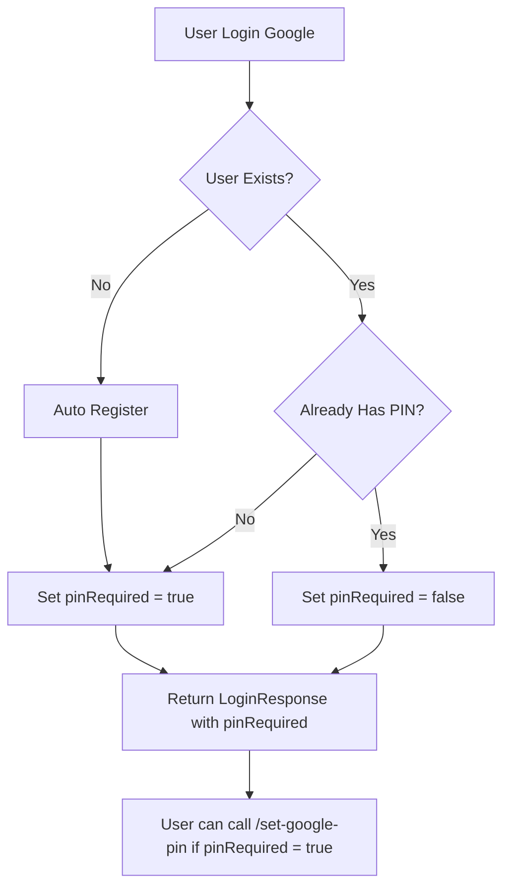

# Plan: Set PIN untuk Google Users

## Latar Belakang

- Google users tidak memiliki password tradisional
- `SetPinRequest` yang ada membutuhkan password validation
- Perlu mekanisme baru khusus untuk Google users

## Arsitektur Proposed

### 1. DTO Baru: `SetGooglePinRequest`

```java
// File: src/main/java/com/lofi/lofiapps/dto/request/SetGooglePinRequest.java
public class SetGooglePinRequest {
    @NotBlank(message = "PIN is required")
    @Size(min = 4, max = 6, message = "PIN must be between 4 and 6 digits")
    private String pin;
}
```

### 2. UseCase Baru: `SetGooglePinUseCase`

```java
// File: src/main/java/com/lofi/lofiapps/service/impl/usecase/user/SetGooglePinUseCase.java
@Service
@RequiredArgsConstructor
public class SetGooglePinUseCase {
    private final UserRepository userRepository;
    private final PasswordEncoder passwordEncoder;

    @Transactional
    public void execute(UUID userId, SetGooglePinRequest request) {
        User user = userRepository.findById(userId)
            .orElseThrow(() -> new RuntimeException("User not found"));

        // Validation: hanya untuk Google users (firebaseUid != null && password == null)
        if (user.getPassword() != null) {
            throw new RuntimeException("Use SetPinRequest for non-Google users");
        }

        user.setPin(passwordEncoder.encode(request.getPin()));
        user.setPinSet(true);
        userRepository.save(user);
    }
}
```

### 3. Endpoint Baru di UserController

```java
// Di UserController.java
@PostMapping("/set-google-pin")
@PreAuthorize("hasRole('CUSTOMER')")
@Operation(summary = "Set PIN for Google users")
public ResponseEntity<ApiResponse<Void>> setGooglePin(@Valid @RequestBody SetGooglePinRequest request) {
    // Get user from security context
    // Call SetGooglePinUseCase
    return ResponseEntity.ok(ApiResponse.success(null, "PIN set successfully"));
}
```

### 4. Update LoginResponse

```java
// Di LoginResponse.java
@Builder.Default
private Boolean pinRequired = false;
```

### 5. Update GoogleLoginUseCase

- Set `pinRequired = true` di response jika user baru register
- Set `pinRequired = false` jika user sudah punya PIN

## Flow Diagram



## File yang Perlu Dibuat/Modifikasi

| No |                         File                         |  Tipe  |           Action            |
|----|------------------------------------------------------|--------|-----------------------------|
| 1  | `dto/request/SetGooglePinRequest.java`               | Create | DTO baru                    |
| 2  | `service/impl/usecase/user/SetGooglePinUseCase.java` | Create | UseCase baru                |
| 3  | `controller/UserController.java`                     | Modify | Tambah endpoint             |
| 4  | `dto/response/LoginResponse.java`                    | Modify | Tambah field pinRequired    |
| 5  | `service/impl/usecase/auth/GoogleLoginUseCase.java`  | Modify | Set pinRequired di response |

## Validasi Tambahan

1. **Penggunaan**: `SetGooglePinUseCase` hanya boleh dipanggil oleh Google users
2. **Security**: Setelah PIN diset, user tidak perlu lagi set PIN
3. **Error Handling**: Tampilkan pesan yang jelas jika non-Google user mencoba akses endpoint ini

## Pertimbangan

- Apakah perlu endpoint terpisah untuk update PIN Google users?
- Apakah perlu mekanisme reset PIN untuk Google users?

