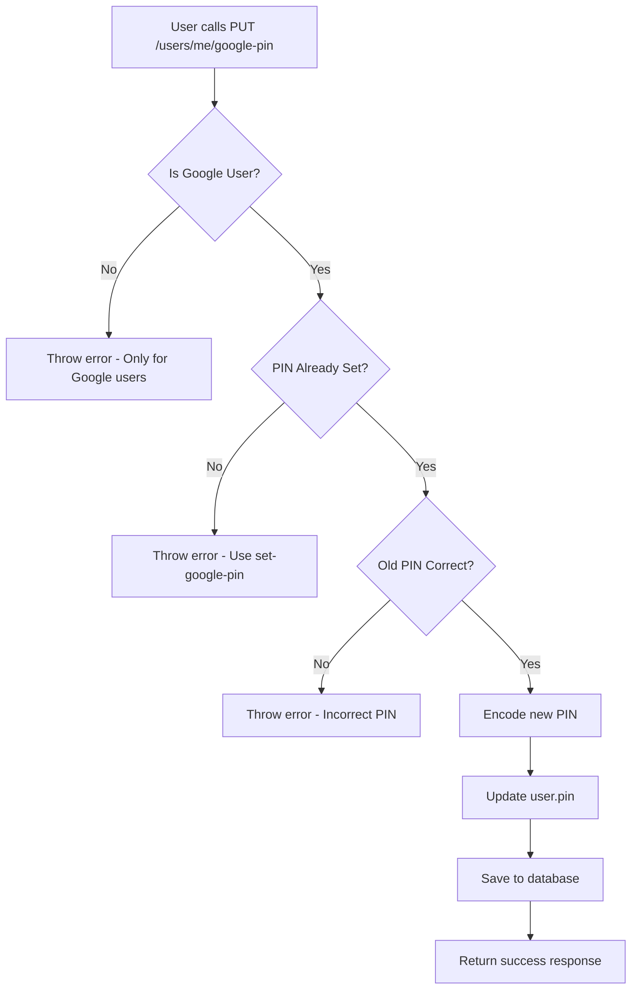

# Plan: Update PIN untuk Google Users

## Latar Belakang

- `SetGooglePinUseCase` sudah ada untuk set PIN awal Google users
- Perlu menambahkan endpoint UPDATE PIN untuk Google users yang sudah memiliki PIN

## Arsitektur Proposed

### 1. DTO Baru: `UpdateGooglePinRequest`

```java
// File: src/main/java/com/lofi/lofiapps/dto/request/UpdateGooglePinRequest.java
public class UpdateGooglePinRequest {
    @NotBlank(message = "Old PIN is required")
    @Size(min = 4, max = 6, message = "PIN must be between 4 and 6 digits")
    private String oldPin;

    @NotBlank(message = "New PIN is required")
    @Size(min = 4, max = 6, message = "PIN must be between 4 and 6 digits")
    private String newPin;
}
```

### 2. UseCase Baru: `UpdateGooglePinUseCase`

```java
// File: src/main/java/com/lofi/lofiapps/service/impl/usecase/user/UpdateGooglePinUseCase.java
@Service
@RequiredArgsConstructor
public class UpdateGooglePinUseCase {

    private final UserRepository userRepository;
    private final PasswordEncoder passwordEncoder;

    @Transactional
    public void execute(UUID userId, UpdateGooglePinRequest request) {
        User user = userRepository.findById(userId)
            .orElseThrow(() -> new RuntimeException("User not found"));

        // Validation: hanya untuk Google users
        if (user.getPassword() != null) {
            throw new RuntimeException("Use UpdatePinRequest for non-Google users");
        }

        if (user.getFirebaseUid() == null) {
            throw new RuntimeException("This endpoint is only for Google authenticated users");
        }

        if (Boolean.FALSE.equals(user.getPinSet())) {
            throw new RuntimeException("PIN is not set. Use set-google-pin endpoint");
        }

        // Validate old PIN
        if (!passwordEncoder.matches(request.getOldPin(), user.getPin())) {
            throw new RuntimeException("Old PIN is incorrect");
        }

        // Update PIN
        user.setPin(passwordEncoder.encode(request.getNewPin()));
        userRepository.save(user);
    }
}
```

### 3. Endpoint Baru di UserController

```java
// Di UserController.java
@PutMapping("/me/google-pin")
@PreAuthorize("hasRole('CUSTOMER')")
@Operation(summary = "Update PIN for Google users")
public ResponseEntity<ApiResponse<Void>> updateGooglePin(
    @Valid @RequestBody UpdateGooglePinRequest request) {
    // Get user from security context
    // Call UpdateGooglePinUseCase
    return ResponseEntity.ok(ApiResponse.success(null, "PIN updated successfully"));
}
```

## Flow Diagram



## File yang Perlu Dibuat/Modifikasi

| No |                          File                           |  Tipe  |     Action      |
|----|---------------------------------------------------------|--------|-----------------|
| 1  | `dto/request/UpdateGooglePinRequest.java`               | Create | DTO baru        |
| 2  | `service/impl/usecase/user/UpdateGooglePinUseCase.java` | Create | UseCase baru    |
| 3  | `controller/UserController.java`                        | Modify | Tambah endpoint |
| 4  | `test/java/.../UpdateGooglePinUseCaseTest.java`         | Create | Unit tests      |

## Pertimbangan

1. **Validasi**: oldPin harus sesuai dengan PIN yang tersimpan
2. **Security**: newPin tidak boleh sama dengan oldPin
3. **Error Handling**: Pesan yang jelas untuk setiap kasus error

